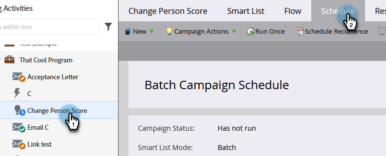
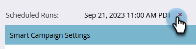
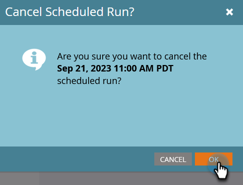

# Cancel a Scheduled Batch Campaign Run {#cancel-a-scheduled-batch-campaign-run}

If you've scheduled a run for one of your batch campaigns and would like to cancel it, here's how.

1. Select the campaign and go to the **[!UICONTROL Schedule]** tab.

   

1. Find the scheduled run you want to cancel and click the **x** next to it.

   

1. Confirm the cancellation by clicking **[!UICONTROL OK]**.

   

>[!NOTE]
>
>Doing this will not help if the run has already started. Use this when you decide a future run needs to be canceled.
