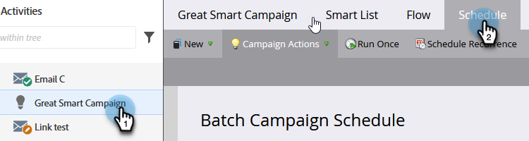
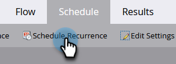
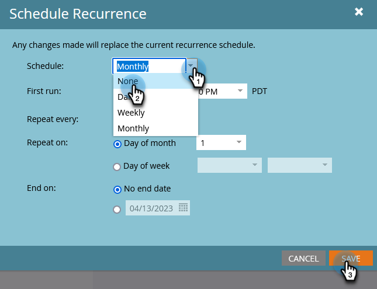

# Cancel a Scheduled Recurring Batch Campaign Run {#cancel-a-scheduled-recurring-batch-campaign-run}

If you have a recurring Batch Campaign that you don't want any more, you can cancel the future runs. Here's how.

1. Select the Smart Campaign and click the **Schedule** tab.

   

1. Click **Schedule Recurrence**.

   

   >[!TIP]
   >
   >You can cancel a single run by clicking on the  next to it. Learn how to [cancel a scheduled batch campaign run](/help/marketo/product-docs/core-marketo-concepts/smart-campaigns/using-smart-campaigns/cancel-a-scheduled-batch-campaign-run.md){target="_blank"}.

1. Set Schedule to **[!UICONTROL None]** and click **[!UICONTROL Save]**.

   

   Voila! Your Smart Campaign will not run anymore.

   >[!CAUTION]
   >
   >This cancels future runs, but if a Smart Campaign is in process of running, you can't cancel it.

   >[!MORELIKETHIS]
   >
   >[Cancel a Scheduled Batch Campaign Run](/help/marketo/product-docs/core-marketo-concepts/smart-campaigns/using-smart-campaigns/cancel-a-scheduled-batch-campaign-run.md){target="_blank"}
