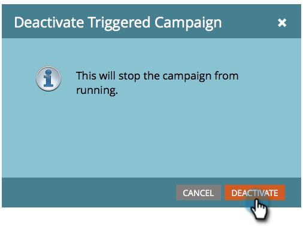

# Deactivate a Trigger Smart Campaign | Schedule Tab {#deactivate-a-trigger-smart-campaign-schedule-tab}

If you have an old trigger campaign that you need to deactivate, follow these steps:

1. Find and select your active trigger campaign.

   

1. Under the Schedule tab, click **Deactivate**.

   

1. Confirm by clicking **Deactivate**.

   

>[!NOTE]
>
>This will stop *new* people from entering the flow, but people in wait steps or any other flow step will continue to move through the flow until done.
