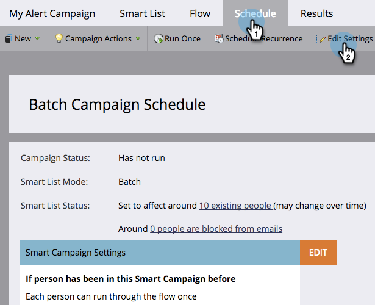
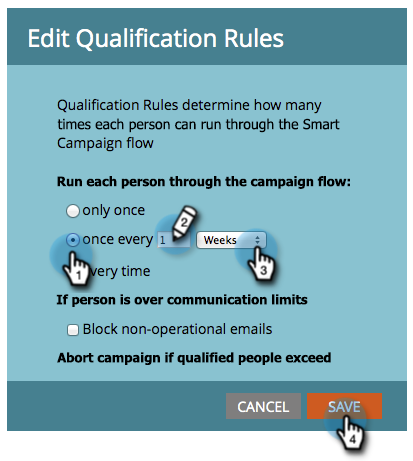

# Edit Qualification Rules in a Smart Campaign {#edit-qualification-rules-in-a-smart-campaign}

Qualification rules control how many times someone can run through the flow in a Smart Campaign. By default, even if someone triggers a Smart Campaign multiple times, they will only be sent through the flow once. Here's how to modify these settings.

1. In your Smart Campaign, click the **[!UICONTROL Schedule]** tab and then **[!UICONTROL Edit Settings]**.

   

   >[!TIP]
   >
   >You can also click **[!UICONTROL Edit]** to the right of "Smart Campaign Settings."

1. Choose how often to run your people through the Smart Campaign flow: **[!UICONTROL only once]**, **[!UICONTROL every time]**, or **once every # days**/**weeks**/**months**.

   

   >[!NOTE]
   >
   >When you set a rule for once every day, Marketo converts that to hours. For example, if you set the rule for once per day, and a person qualifies at 10pm on a Sunday night, it can't qualify again until 10pm Monday night. This logic also applies when using weeks or months. A month is always counted as 30 days.

   >[!NOTE]
   >
   >Communication limits are not applied to Smart Campaigns by default. Learn how to [apply communication limits to a Smart Campaign](/help/marketo/product-docs/core-marketo-concepts/smart-campaigns/using-smart-campaigns/apply-communication-limits-to-smart-campaign.md){target="_blank"}.

   >[!NOTE]
   >
   >[Apply Communication Limits to Smart Campaigns](/help/marketo/product-docs/core-marketo-concepts/smart-campaigns/using-smart-campaigns/apply-communication-limits-to-smart-campaign.md){target="_blank"}

Mission accomplished! You now know how to control qualification rules in a Smart Campaign.
