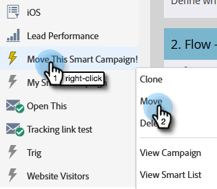
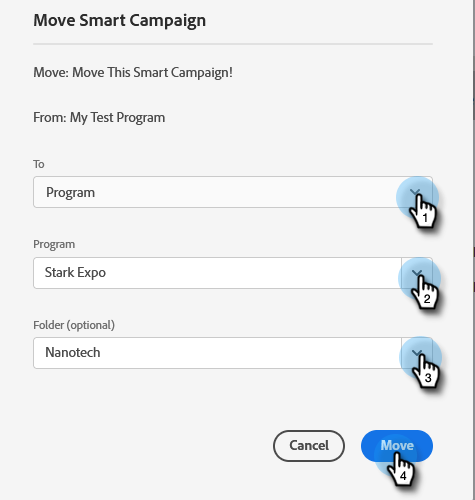
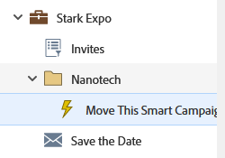

# Move a Smart Campaign {#move-a-smart-campaign}

Move a smart campaign between different programs or folders by using drag-and-drop or the move feature in the tree. The rules of your smart campaign will not change, it will just be nested in a different place.

>[!CAUTION]
>
>Because the rules will not change, if the campaign’s Smart List or Flow Steps reference the original program, you must manually update that information to reflect its new program, as it will **not** auto-update.

1. Go to **[!UICONTROL Marketing Activities]**.

   

1. Locate the Smart Campaign you want to move, right-click on it and select **[!UICONTROL Move]**.

   

1. Select the **[!UICONTROL To]** (destination), **[!UICONTROL Program]**, and optional **[!UICONTROL Folder]**. Select **[!UICONTROL Move]**.

   

   >[!NOTE]
   >
   >In this example we're moving the Smart Campaign to another program, but you can also move it to a campaign folder.

Well done! The Smart Campaign has been moved.

   
