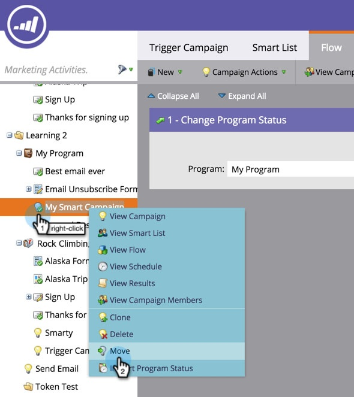
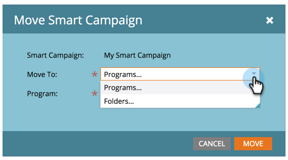
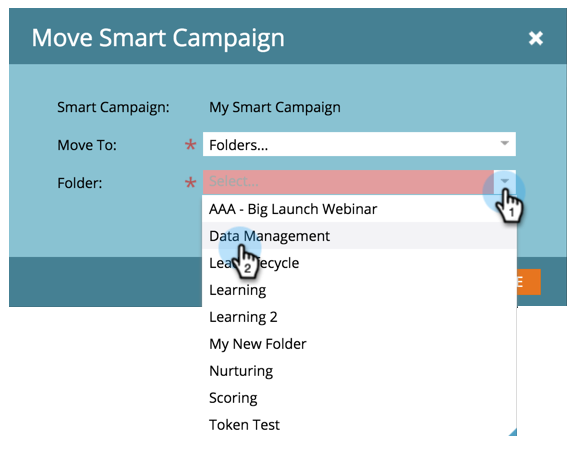
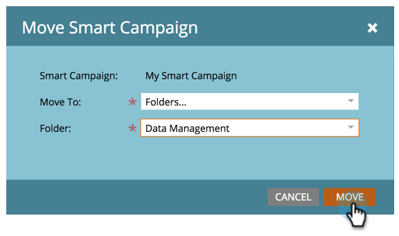

# Move a Smart Campaign {#move-a-smart-campaign}

Move a smart campaign between different programs or folders by using drag-and-drop or the move feature in the tree.

## Use Drag-and-Drop {#use-drag-and-drop}

1. Go to **Marketing Activities**.

   

1. Select the smart campaign and drag and drop it into a new program.

   

   Awesome! That smart campaign is now in a new program. This works with folders as well.

   >[!NOTE]
   >
   >The rules of your smart campaign will not change - it will just be nested in a different place.

## Use the Move Feature {#use-the-move-feature}

Smart campaigns can also be moved using the move feature in the tree.

1. Right-click the smart campaign. Select **Move**.

   

1. Choose between moving to a **Program** or a **Folder**.

   

1. Select the specific place for the smart campaign to move.

   

1. Click **Move**.

   

   High five! This smart campaign has been moved.

   
