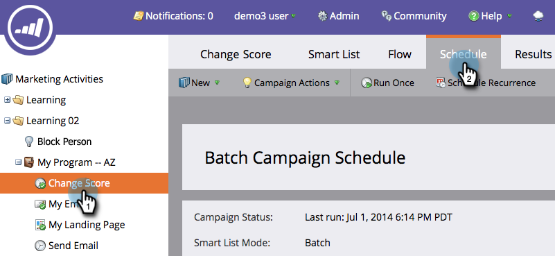
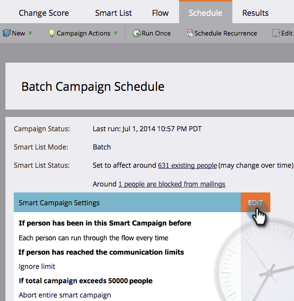

# Override Person Restrictions in a Smart Campaign {#override-person-restrictions-in-a-smart-campaign}

Marketo allows you to set the maximum number of people that can qualify for a smart campaign; this helps you avoid accidentally emailing your whole database. If you want to _override_ this limit, here's how.

>[!PREREQUISITES]
>
>Be sure to [enable person restrictions for smart campaigns](/help/marketo/product-docs/administration/email-setup/enable-person-restrictions-for-smart-campaigns.md) in Marketo Admin.

1. In Marketing Activities, go to your smart campaign and click **Schedule**.

   

1. In Smart Campaign Settings, click **Edit**.

   

   >[!NOTE]
   >
   >The default limit is the one set in Admin.

1. Enter a new limit and then click **Save.**

   

   The smart campaign will not run if the number of people who qualify exceed the set limit.

   >[!CAUTION]
   >
   >Be careful with this feature so that you do not accidentally include too many people.
