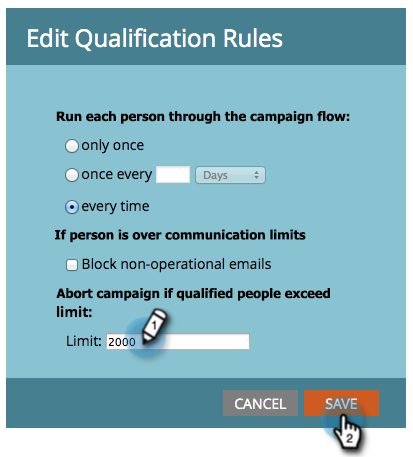

# Override Person Restrictions in a Smart Campaign {#override-person-restrictions-in-a-smart-campaign}

Marketo Engage allows you to set the maximum number of people that can qualify for a Smart Campaign; this helps you avoid accidentally emailing your whole database. If you want to _override_ this limit, here's how.

>[!PREREQUISITES]
>
>Be sure to [enable person restrictions for Smart Campaigns](/help/marketo/product-docs/administration/email-setup/enable-person-restrictions-for-smart-campaigns.md){target="_blank"} in Marketo Admin.

1. In **[!UICONTROL Marketing Activities]**, go to your Smart Campaign and click **[!UICONTROL Schedule]**.

   

1. In Smart Campaign Settings, click **[!UICONTROL Edit]**.

   

   >[!NOTE]
   >
   >The default limit is the one set in Admin.

1. Enter a new limit and click **[!UICONTROL Save]**.

   

   The Smart Campaign will not run if the number of people who qualify exceed the set limit.

   >[!CAUTION]
   >
   >Be careful with this feature so that you don't accidentally include too many people.
