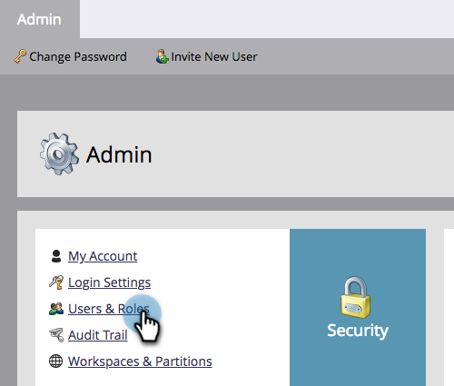
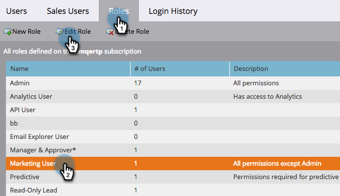
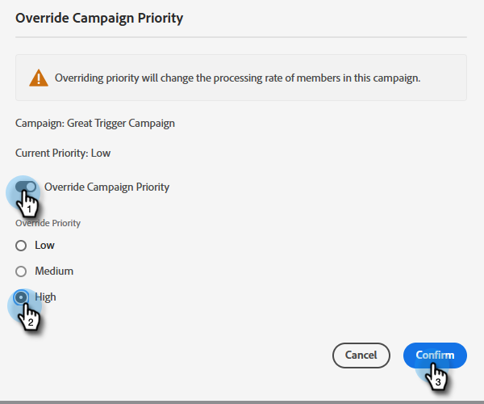
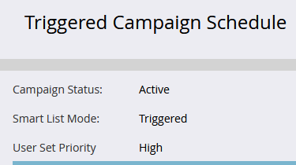

# Priority Override for Trigger Campaigns {#priority-override-for-trigger-campaigns}

Admins can override the Marketo Engage determined priority for Trigger Campaigns to set priorities that better align with business objectives.

>[!NOTE]
>
>This feature is only available for Trigger Campaigns and to users who have been granted the ["Edit Trigger Campaign Priority" permission](#grant-priority-override-access).

>[!CAUTION]
>
>It is strongly advised that you use this feature on a limited set of business critical campaigns (25 is the recommended maximum). Using the feature loosely on a large set can adversely affect overall campaign execution.

## Grant Priority Override Access {#grant-priority-override-access}

>[!NOTE]
>
>Only Admins or users with admin responsibilities should have campaign priority override access.

1. In the **[!UICONTROL Admin]** area, click **[!UICONTROL Users & Roles]**.

   

1. Click the **[!UICONTROL Roles]** tab, select the user you want to grant access to, then click **[!UICONTROL Edit Role]**.

   

1. Under **[!UICONTROL Access Marketing Activities]**, select **[!UICONTROL Edit Trigger Campaign Priority]**. Click **[!UICONTROL Save]**.

   

## Override Priority {#override-priority}

1. Locate your Trigger Campaign. Right-click on it and select **[!UICONTROL Override Campaign Priority]**.

   

1. Click the **[!UICONTROL Override Campaign Priority]** slider to enable. Choose a new priority level and click **[!UICONTROL Confirm]**.

   

   The new priority level will show in the **[!UICONTROL Schedule]** tab.

   

>[!NOTE]
>
>* You can view your campaign's default priority in the [!UICONTROL Campaign Queue] under [!UICONTROL Marketing Activities]. To boost execution rate, we recommend setting your campaign priority to one level higher than its default.
>* User set priority applies only to new people who qualify for the campaign; people who are already in-queue will not be affected.
>* Priority overrides are captured in [Audit Trail](/help/marketo/product-docs/administration/audit-trail/audit-trail-overview.md){target="_blank"}.
