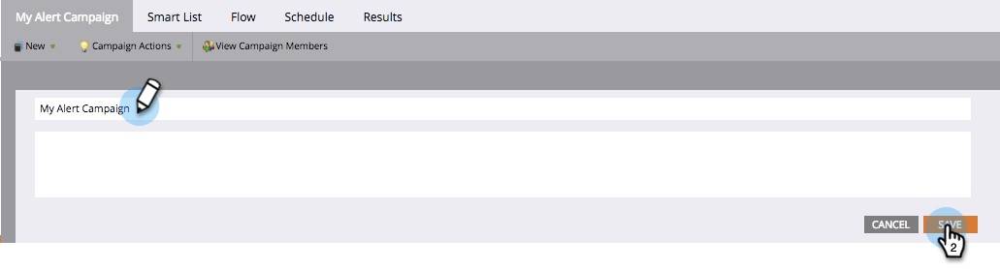

# Rename a Smart Campaign {#rename-a-smart-campaign}

You can change the name of an existing smart campaign. Here's how.

1. Go to **[!UICONTROL Marketing Activities]**.

   

1. Select your Smart Campaign, then click on its name.

   

   >[!TIP]
   >
   >Smart campaign names within programs always translate to the format 'ProgramName.CampaignName'.

1. Enter the new smart campaign name and click **[!UICONTROL Save]**.

   

   >[!NOTE]
   >
   >The old name is visible in the tab and it changes upon saving.

Quick and easy! Anywhere the smart campaign is referenced will be changed too.
