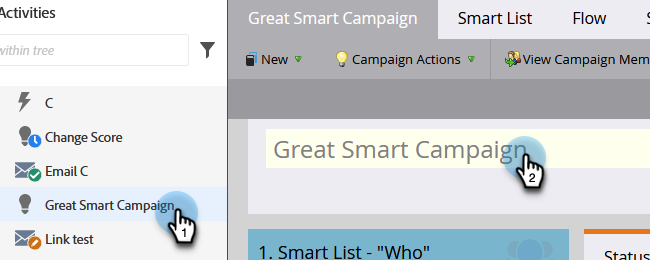
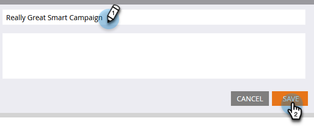

# Rename a Smart Campaign {#rename-a-smart-campaign}

You can change the name of an existing Smart Campaign. Here's how.

1. Go to **Marketing Activities**.

   

1. Select your Smart Campaign, then click on its name.

   

   >[!TIP]
   >
   >Smart Campaign names within programs always translate to the format 'ProgramName.CampaignName'.

1. Enter the new Smart Campaign name and click **Save**.

   

   >[!NOTE]
   >
   >The old name is visible in the tab and it changes upon saving.

Quick and easy! Anywhere the Smart Campaign is referenced will be changed too.
