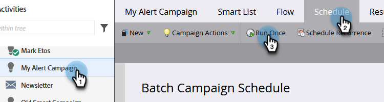
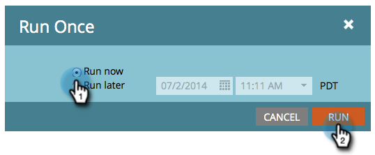
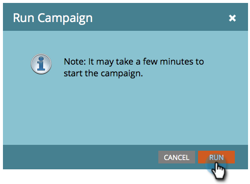

# Run a Batch Smart Campaign Now | Schedule Tab {#run-a-batch-smart-campaign-now-schedule-tab}

Once you are done building your batch campaign, you can choose to run it now or later. Here's how to run it immediately.

1. Select the batch smart campaign, go to the **Schedule** tab and click **Run Once**.

   

1. Make sure **Run Now** is selected and click **Run**.

   

1. Confirm by clicking **Run** one more time.

   

   Easy peasy! You can also [schedule runs for later](/help/marketo/product-docs/core-marketo-concepts/smart-campaigns/using-smart-campaigns/schedule-a-batch-smart-campaign-to-run-later.md) if you prefer.

   >[!NOTE]
   >
   >* [Schedule a Batch Smart Campaign to Run Later](/help/marketo/product-docs/core-marketo-concepts/smart-campaigns/using-smart-campaigns/schedule-a-batch-smart-campaign-to-run-later.md)
   >* [Schedule a Recurring Batch Campaign](/help/marketo/product-docs/core-marketo-concepts/smart-campaigns/using-smart-campaigns/schedule-a-recurring-batch-campaign.md)
