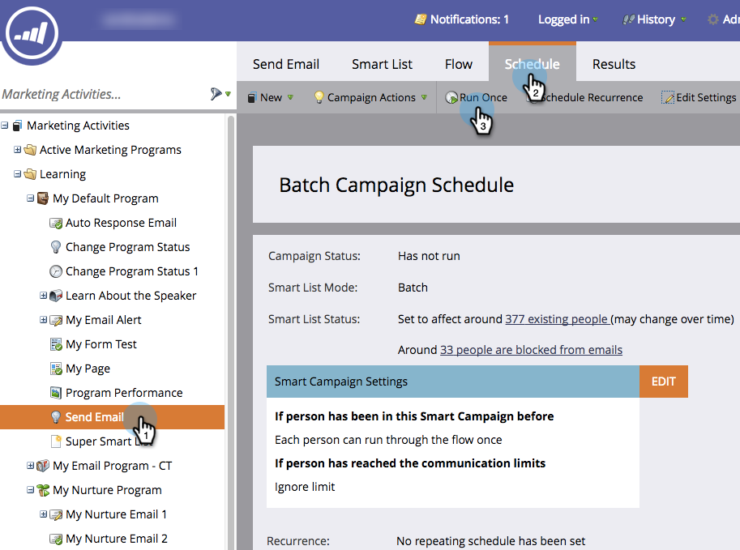
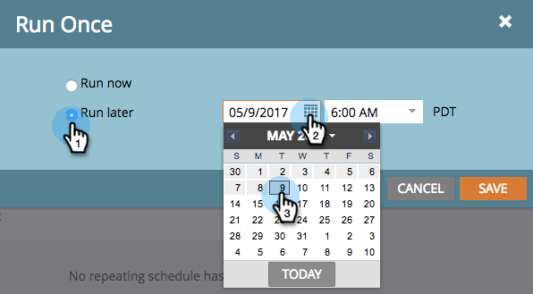
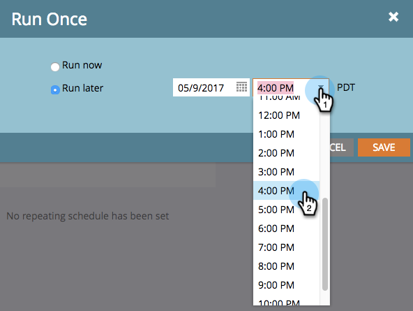

# Schedule a Batch Smart Campaign to Run Later {#schedule-a-batch-smart-campaign-to-run-later}

If you want to set a batch smart campaign to run at some point in the future, here's how.

>[!TIP]
>
>You can also [reschedule a batch smart campaign in the program schedule view](/help/marketo/product-docs/core-marketo-concepts/programs/program-schedule-view/reschedule-a-batch-smart-campaign-in-the-program-schedule-view.md).

1. Select the batch smart campaign you want to run, go to the **Schedule** tab, and click **Run Once**.

   

1. Click **Run later**, then click the calendar icon and select the day you want the smart campaign to run on.

   

1. Select the time you want the smart campaign to run at (minimum 15 minutes ahead).

   

1. Click **Save**.

   

1. You can confirm the scheduled run by looking at the **Schedule** tab.

   

   >[!NOTE]
   >
   >[Schedule a Recurring Batch Campaign](/help/marketo/product-docs/core-marketo-concepts/smart-campaigns/using-smart-campaigns/schedule-a-recurring-batch-campaign.md)
