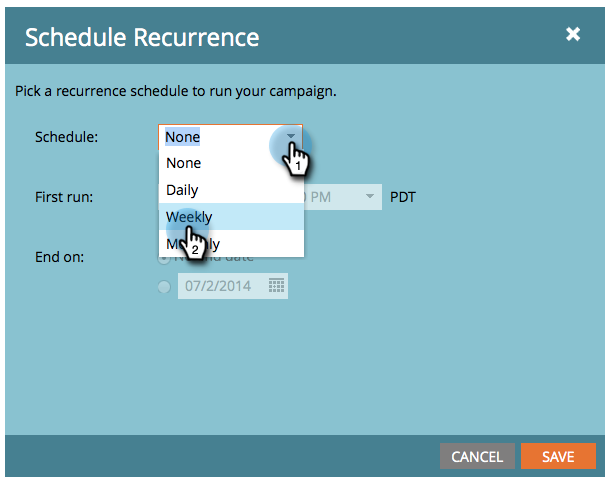
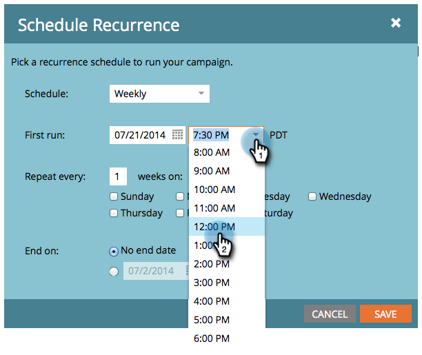
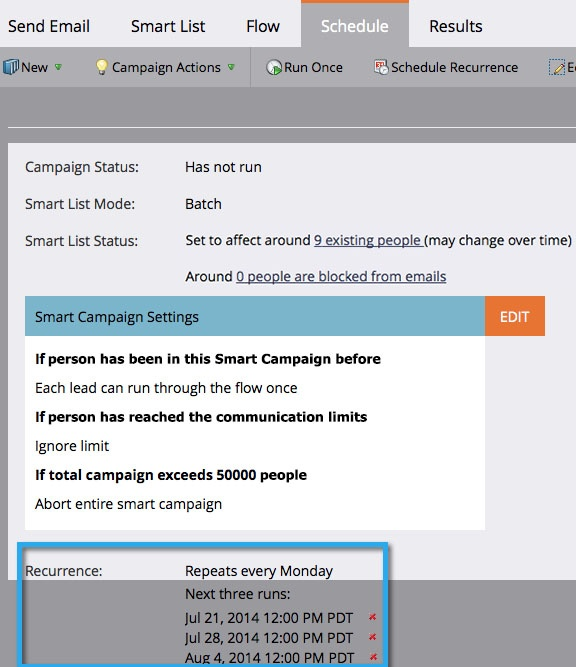

# Schedule a Recurring Batch Campaign {#schedule-a-recurring-batch-campaign}

Recurrence allows you to run a batch smart campaign on a regular schedule. For example - once a week, Mondays at 12:00 PM.

##### 1. Select the campaign, go to the Schedule tab, and click Schedule Recurrence. {#select-the-campaign-go-to-the-schedule-tab-and-click-schedule-recurrence}

  

##### 2. Click the Schedule drop-down and select Weekly. {#click-the-schedule-drop-down-and-select-weekly}

  

##### 3. Click the calendar icon and select the day for the first run. For this example, we are using the next available Monday. {#click-the-calendar-icon-and-select-the-day-for-the-first-run-for-this-example-we-are-using-the-next-available-monday}

  

##### 4. Select the time at which it should run. {#select-the-time-at-which-it-should-run}

  

##### 5. Leave Repeat every as 1, select Monday&nbsp;and click Save. {#leave-repeat-every-as-select-monday-and-click-save}

  

##### 6. You can see the scheduled recurrences under the Schedule tab to validate. {#you-can-see-the-scheduled-recurrences-under-the-schedule-tab-to-validate}

>[!NOTE]
>
>The Schedule tab will show the next three occurrences for reference.

And that's it! Your batch campaign will now run every Monday at noon. 