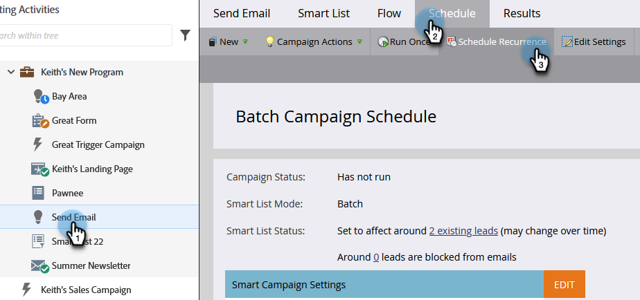
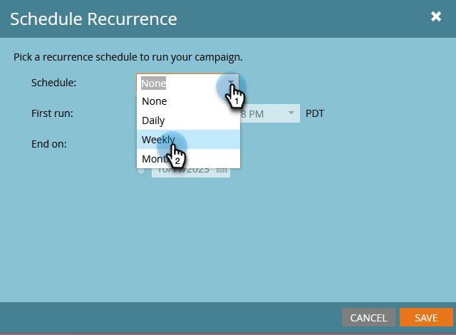
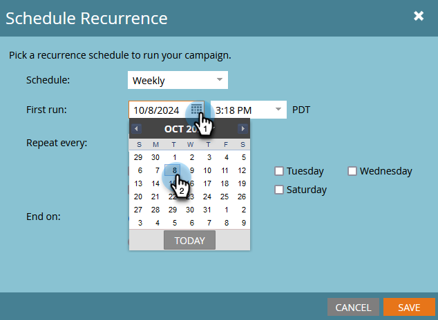
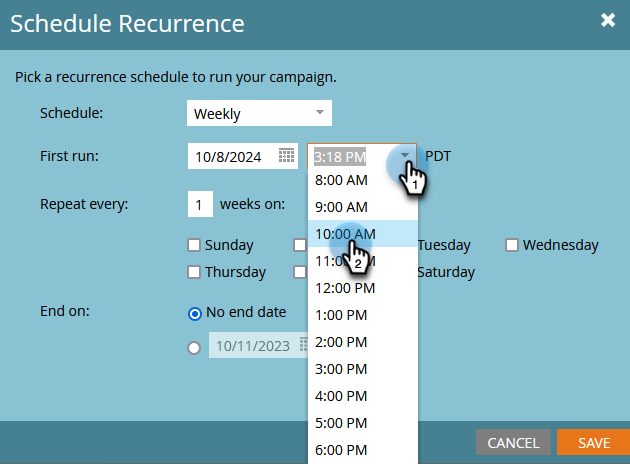
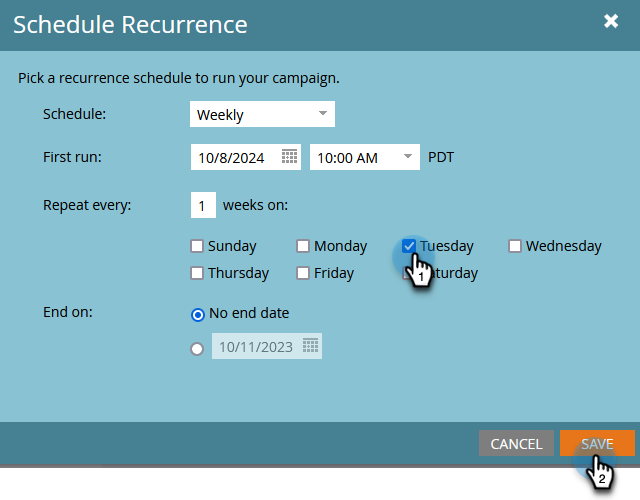
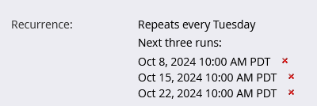

# Schedule a Recurring Batch Campaign {#schedule-a-recurring-batch-campaign}

Recurrence allows you to run a Batch Campaign on a regular schedule. For example - once a week, Tuesdays at 10:00 AM.

1. Select the Smart Campaign, go to the **[!UICONTROL Schedule]** tab, and click **[!UICONTROL Schedule Recurrence]**.

   

1. Click the **[!UICONTROL Schedule]** drop-down and select **[!UICONTROL Weekly]**.

   

1. Click the calendar icon and select the desired day for the first run.

   

1. Select the time at which it should run.

   

1. Leave "[!UICONTROL Repeat every]" as 1, select Tuesday and click **[!UICONTROL Save]**.

   

   >[!NOTE]
   >
   >For a specific run length, you can click the calendar icon next to **[!UICONTROL End on]** and choose the end date.

The scheduled recurrences are displayed at the bottom of the Schedule tab.

   

>[!NOTE]
>
>The Schedule tab will show the next three occurrences for reference. Clicking the red **X** will cancel that specific run.
