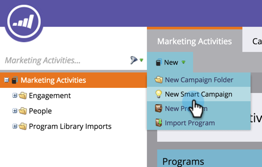
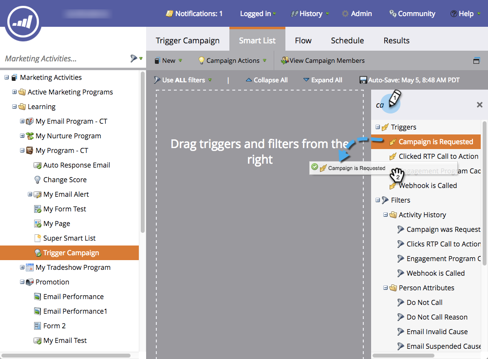

# Setting Up a Trigger Smart Campaign for Sales Using "Campaign is Requested" {#setting-up-a-trigger-smart-campaign-for-sales-using-campaign-is-requested}

Setting Up a Trigger Smart Campaign for Sales Using "Campaign is Requested" - Marketo Docs - Product Documentation

One of the coolest features of Marketo is the ability to let sales people participate in the marketing effort. They're on the front lines, interacting with people. Sales reps should have the ability to steer marketing in the right direction.

>[!NOTE]
>
>**FYI**
>
>Marketo is now standardizing language across all subscriptions, so you may see lead/leads in your subscription and person/people in docs.marketo.com. These terms mean the same thing; it does not affect article instructions. There are some other changes, too. [Learn more](http://docs.marketo.com/display/DOCS/Updates+to+Marketo+Terminology).

>[!NOTE]
>
>**Example**
>
>Examples of smart campaigns to request:
>
>1. **Long term nurture** - when they don't have a budget this year and you just want to stay on the radar
>1. **Active sales cycle** - when the sales person doesn't want any messages to the person except their own. (use the marketing suspended flag to temporarily unsubscribe them)
>
>Be creative. What would the sales person like to automate? Just ask them and wire it up!

1. Create a **Smart Campaign.**

   

1. Find and drag&nbsp;**Campaign** **is** **Requested **to the canvas.

   &nbsp; 

1. The source choices indicate what kind of request will be honored. For Salesforce functionality, make sure to choose **Sales** **Insight**.

   >[!TIP]
   >
   >The source operators are for security. You can restrict the campaign to requests made only by specific sources, like other smart campaigns or developers. Choose **Is Any** in the first box if you want to allow requests from all sources.
   >
   >
   >**Remember**, by choosing Sales Insight, it will magically show up in the box for sales. Don't overdo it. Too many will get ignored by them.

   

This is a great way to extend your marketing reach into other departments. Set up all kinds of campaigns to automate.

>[!TIP]
>
>Don't forget to name your smart campaigns clearly. They will show up in Sales Insight exactly how you name them.

