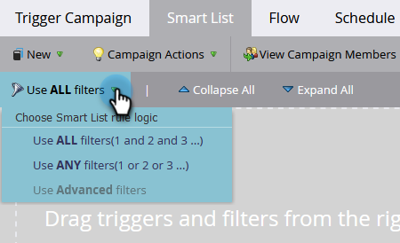
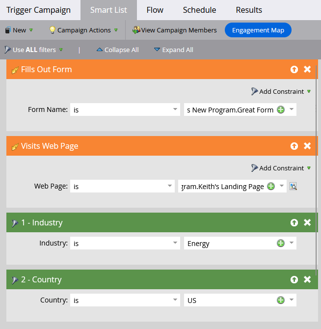

# Using Standard Smart List Rule Logic {#using-standard-smart-list-rule-logic}

You may have noticed the "Use filters" option when building campaign Smart Lists. This setting allows you to decide if the filters need to be evaluated with an AND or an OR operator.



>[!NOTE]
>
>Changing smart list rule logic only applies to filters, _not_ triggers.

Triggers are always evaluated as OR even if the above setting is set to ALL. Here's an example:



The above Smart List in words:

```box
IF person fills out Great Form
OR
IF person visits Keith's Landing Page 
AND 
Industry is Energy 
AND 
Country is US 
THEN follow the campaign's flow step(s)
```

So, if a person fills out the form _or_ visits the page, the campaign will then evaluate that person based on _all_ or _any_ of the subsequent filters, depending on the setting used.

>[!MORELIKETHIS]
>
>[Using Advanced Smart List Rule Logic](/help/marketo/product-docs/core-marketo-concepts/smart-lists-and-static-lists/using-smart-lists/using-advanced-smart-list-rule-logic.md){target="_blank"}
