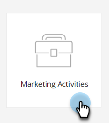

# Create a Smart List {#create-a-smart-list}

Smart Lists allow you to find specific groups of people using simple filters. Here's how to create one.

1. Go to **[!UICONTROL Marketing Activities]**.

   

1. Select the program you want to create the Smart List in.

   

1. Under **[!UICONTROL New]**, click **[!UICONTROL New Local Asset]**.

   

1. Select **[!UICONTROL Smart List]**.

   

1. Enter a **[!UICONTROL Name]** and click **[!UICONTROL Create]**.

   

   Ta-da, great job! Now let's add and define some filters.

   >[!MORELIKETHIS]
   >
   >[Find and Add Filters to a Smart List](/help/marketo/product-docs/core-marketo-concepts/smart-lists-and-static-lists/creating-a-smart-list/find-and-add-filters-to-a-smart-list.md){target="_blank"}
