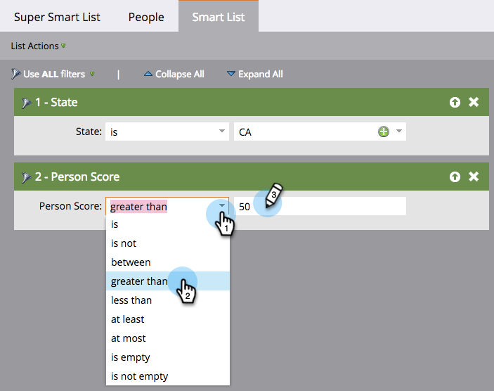

# Define Smart List Filters {#define-smart-list-filters}

>[!PREREQUISITES]
>
>* [Create a Smart List](create-a-smart-list.md)
>* [Find and Add Filters to Smart Lists](find-and-add-filters-to-a-smart-list.md)

Now that you've [created a smart list](/help/marketo/product-docs/core-marketo-concepts/smart-lists-and-static-lists/creating-a-smart-list/create-a-smart-list.md) and [added filters](/help/marketo/product-docs/core-marketo-concepts/smart-lists-and-static-lists/creating-a-smart-list/find-and-add-filters-to-a-smart-list.md) to it, let's define the filters. Here's how.

Continuing our example, let's define these filters to find all people in California with a score over 50.

1. Go to **[!UICONTROL Marketing Activities]**.

   

1. Select the smart list and click on the **[!UICONTROL Smart List]** tab.

   

1. Find and select **CA** for the **[!UICONTROL State]** filter.

   

   >[!NOTE]
   >
   >You may be storing both **California** and **CA**. In order to filter for both values and include _all_ people from California, learn how to  [add multiple values to a smart list filter](/help/marketo/product-docs/core-marketo-concepts/smart-lists-and-static-lists/using-smart-lists/add-multiple-values-to-a-smart-list-filter.md).

1. Pick the **[!UICONTROL greater than]** operator and enter **50**.

   

>[!TIP]
>
>If you think you may have some records in your database that contain incomplete email addresses (e.g., just "@adobe.com"), use **two** Email Address filters when you're using the "contains" operator. One filter with "contains @adobe.com," and a separate filter with "contains adobe.com" (leaving out the @ symbol).

You now know how to create a smart list and add/define filters.
