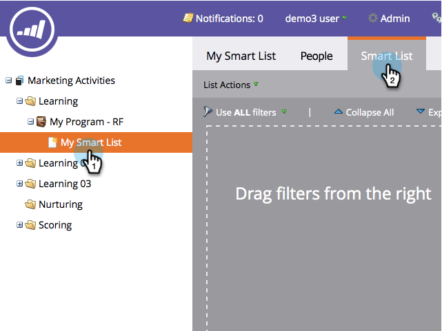

# Find and Add Filters to a Smart List {#find-and-add-filters-to-a-smart-list}

Once you've [created a Smart List](/help/marketo/product-docs/core-marketo-concepts/smart-lists-and-static-lists/creating-a-smart-list/create-a-smart-list.md){target="_blank"}, you need to add and [define](/help/marketo/product-docs/core-marketo-concepts/smart-lists-and-static-lists/creating-a-smart-list/define-smart-list-filters.md){target="_blank"} filters. Here's how to find and add filters.

In this example, let's find all people in California with a score over 50.

>[!TIP]
>
>Explore the tree on the right - filters are very powerful and have a wide variety of possible functions.

1. Go to **[!UICONTROL Marketing Activities]**.

   

1. Select the Smart List you want to add filters to and click the **[!UICONTROL Smart List]** tab.

   

1. Find and drag the **[!UICONTROL State]** filter onto the canvas.

   

1. Also find and drag the **[!UICONTROL Score]** filter over.

   

Perfect! Let's go ahead and define these filters.

>[!MORELIKETHIS]
>
>* [Create a Smart List](/help/marketo/product-docs/core-marketo-concepts/smart-lists-and-static-lists/creating-a-smart-list/create-a-smart-list.md){target="_blank"}
>* [Define Smart List Filters](/help/marketo/product-docs/core-marketo-concepts/smart-lists-and-static-lists/creating-a-smart-list/define-smart-list-filters.md){target="_blank"}
