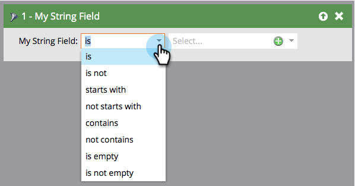

# Smart List Filter Operators Glossary {#smart-list-filter-operators-glossary}

An operator is a part of the Smart List that helps you get specific. It lets you describe your filter or trigger in straightforward language. The available operators are different for each type of field.

Here's a glossary describing each set of operators.

## Date Fields {#date-fields}

When you choose an operator, the right side will change dynamically.

<table><thead>
  <tr>
    <th>Operator</th>
    <th>Right Side</th>
    <th>Description</th>
  </tr></thead>
<tbody>
  <tr>
    <td>is</td>
    <td>Single Date</td>
    <td>Exact date match</td>
  </tr>
  <tr>
    <td>is not</td>
    <td>Single Date</td>
    <td>Any date EXCEPT the one specified</td>
  </tr>
  <tr>
    <td>between</td>
    <td>Two Date Fields</td>
    <td>Any date including and between two specified dates</td>
  </tr>
  <tr>
    <td>in past</td>
    <td>Natural Language Input*</td>
    <td>See diagram below</td>
  </tr>
  <tr>
    <td>in past before</td>
    <td>Natural Language Input*</td>
    <td>See diagram below</td>
  </tr>
  <tr>
    <td>in future</td>
    <td>Natural Language Input*</td>
    <td>See diagram below</td>
  </tr>
  <tr>
    <td>in future after</td>
    <td>Natural Language Input*</td>
    <td>See diagram below</td>
  </tr>
  <tr>
    <td>in time frame</td>
    <td>Presets (last quarter, yesterday etc)</td>
    <td>Defined in picklist</td>
  </tr>
  <tr>
    <td>after</td>
    <td>Single Date</td>
    <td>All records after the specified date</td>
  </tr>
  <tr>
    <td>before</td>
    <td>Single Date</td>
    <td>All records before the specified one</td>
  </tr>
  <tr>
    <td>on or after</td>
    <td>Single Date</td>
    <td>Same as "after" but inclusive</td>
  </tr>
  <tr>
    <td>on or before</td>
    <td>Single Date</td>
    <td>Same as "before" but inclusive</td>
  </tr>
  <tr>
    <td>is empty</td>
    <td>None</td>
    <td>All records without a date</td>
  </tr>
  <tr>
    <td>is not empty</td>
    <td>None</td>
    <td>All records with any date</td>
  </tr>
</tbody></table>

**&#42;** Natural language input is cool. Here are some of the patterns you can enter:

* 1 hour
* 82 days
* 3 weeks
* 14 months
* 1 year

Just type the number and unit together and it'll work!

>[!NOTE]
>
>"In past" _does_ include the day (up until the time, not after) you create your Smart List.

>[!CAUTION]
>
>When you create a Smart List using a date field filter (e.g., Date of Birth, SFDC Created Date) and use the constraints **[!UICONTROL before]**, **[!UICONTROL on or before]**, or **[!UICONTROL in past before]**, the Smart List will also include people who have no value in said date field.

Use the following diagram to understand the difference between the date operators.

>[!NOTE]
>
>**Example**
>
>Date fields can get tricky when you're working with past and future events. Here are a couple of examples.
>
>**[!UICONTROL In past before]**
>
>For your new promotion, use this operator to send emails only to people who have not subscribed to or renewed your service within one year or have never been subscribers.
>
>**[!UICONTROL In future after]**
>
>Say you want to see customers who are up for renewal in 90 days. You would use two separate filters. First use "In Future After 90 days," and second, "In Future 91 Days." That would capture whomever has a date 90 days from now.

## String Fields {#string-fields}

<table><thead>
  <tr>
    <th>Operator</th>
    <th>Description</th>
  </tr></thead>
<tbody>
  <tr>
    <td>is</td>
    <td>Exact match (not case sensitive)</td>
  </tr>
  <tr>
    <td>is not</td>
    <td>Anything EXCEPT exact match</td>
  </tr>
  <tr>
    <td>starts with</td>
    <td>First letters of string match</td>
  </tr>
  <tr>
    <td>not starts with</td>
    <td>First letters of string DO NOT match</td>
  </tr>
  <tr>
    <td>contains</td>
    <td>Any letters together in the string match (example: california, fortune, therefor)</td>
  </tr>
  <tr>
    <td>not contains</td>
    <td>No letters together in the string match. (reverse of "contains")</td>
  </tr>
  <tr>
    <td>is empty</td>
    <td>Records that have no value (NULL)</td>
  </tr>
  <tr>
    <td>is not empty</td>
    <td>Records with ANY value</td>
  </tr>
</tbody>
</table>

>[!TIP]
>
>Use positive over negative operators. "Is not" filters have to search the entire data set in your instance, which can be extremely time-consuming. Positive "is" filters can leverage more effective search algorithms.

## Integer Fields {#integer-fields}

<table><thead>
  <tr>
    <th>Operator</th>
    <th>Description</th>
  </tr></thead>
<tbody>
  <tr>
    <td>is</td>
    <td>Exact number match ( = 0 will return both leads with 0 and NULL)</td>
  </tr>
  <tr>
    <td>is not</td>
    <td>Anything EXCEPT exact number match</td>
  </tr>
  <tr>
    <td>between</td>
    <td>Define two value to find everyone in between (inclusive)</td>
  </tr>
  <tr>
    <td>greater than</td>
    <td>Above the specified</td>
  </tr>
  <tr>
    <td>less than</td>
    <td>Less than the specified</td>
  </tr>
  <tr>
    <td>at least</td>
    <td>Above the specified (inclusive)</td>
  </tr>
  <tr>
    <td>at most</td>
    <td>Less than the specified (inclusive)</td>
  </tr>
  <tr>
    <td>is empty</td>
    <td>Records that have no value (NULL) - zero is a number, it is not NULL</td>
  </tr>
  <tr>
    <td>is not empty</td>
    <td>Records with ANY value (including zero)</td>
  </tr>
</tbody>
</table>

As you can see, these operators make it easy to speak Marketo-ese with fluency!
