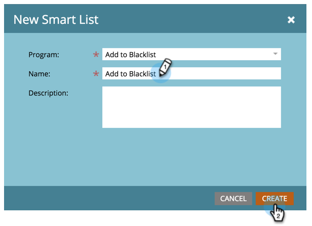
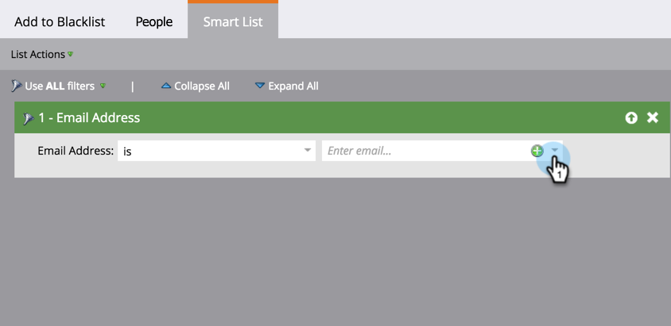
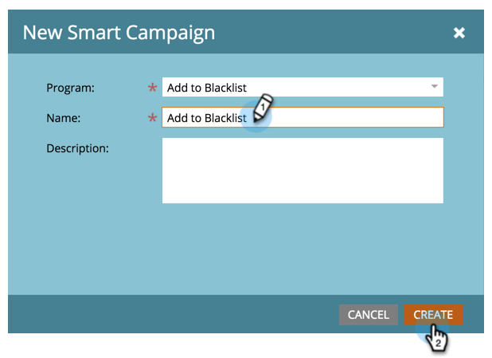
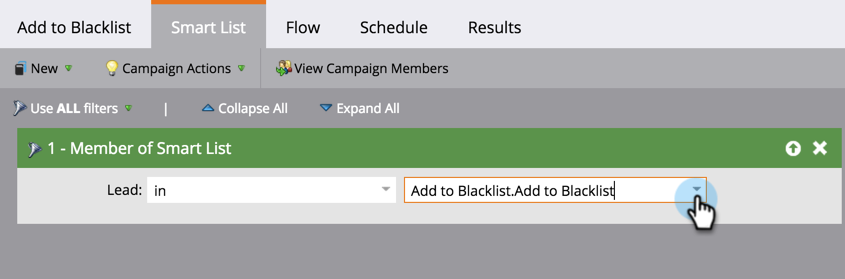
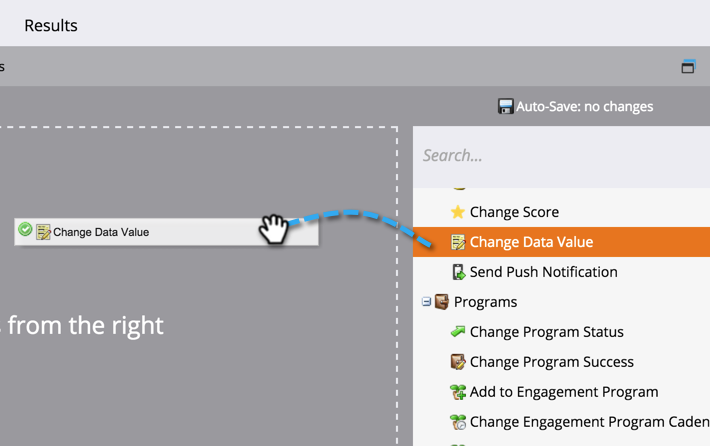
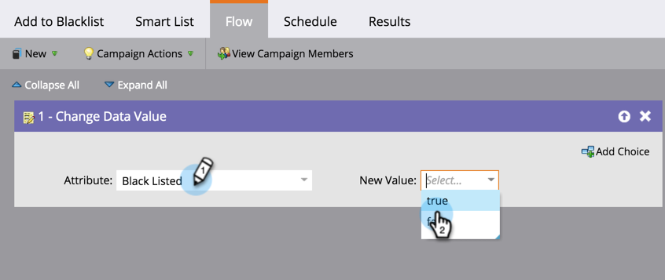
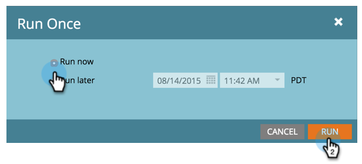

# Add Person to Blocklist {#add-person-to-blocklist}

Adding people to your Blocklist prevents them from receiving your correspondence.

>[!NOTE]
>
>Marketo is in the process of changing terms such as Blacklist and Whitelist to Blocklist and Allowlist in our product. During this update, you may see the old terms in our UI and documentation screenshots, and the new terms in our documentation text. We apologize for any confusion.

1. [Create a new default program](/help/marketo/product-docs/core-marketo-concepts/programs/creating-programs/create-a-program.md) and name it **Add to Blocklist**.

1. Click **New** and select **New Local Asset**.

   

1. Name your list and click **Create**.

   

1. Add all the people to your **Smart List** you want added to your Blocklist.

   >[!NOTE]
   >
   >People on your Blocklist will not receive operational emails.

   

1. Click **New** and select **New Smart Campaign**.

   

1. Name the **New Smart Campaign**. Click **Create**.

   

1. Drag and drop **Member of Smart List**.

   

1. Select the smart list you just created.

   

1. Drag and drop **Change Data Value**.

   

1. For the **Flow**, enter **Block Listed** for the **Attribute** and set **New Value** to **true**.

   

1. On the **Schedule** tab, select **Run Once**.

   

1. Select **Run now** and click **Run**.

   

   YAY! These people will no longer receive emails.

   >[!TIP]
   >
   >Create a [trigger smart campaign](/help/marketo/product-docs/core-marketo-concepts/smart-campaigns/creating-a-smart-campaign/create-a-new-smart-campaign.md) using **Change Data Value** with **Block Listed is true** for all people in the future that have blocklist-able attributes.
