# Add Person to Blocklist {#add-person-to-blocklist}

Adding people to your Blocklist prevents them from receiving your correspondence.

1. [Create a new default program](/help/marketo/product-docs/core-marketo-concepts/programs/creating-programs/create-a-program.md) and name it **Add to Blocklist**.

1. Click **New** and select **New Local Asset**.

   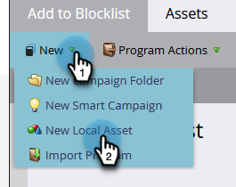

1. Select **Smart List**.

   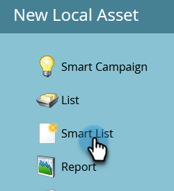

1. Name your list and click **Create**.

   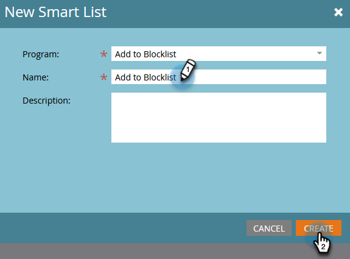

1. Add all the people to your **Smart List** you want added to your Blocklist.

   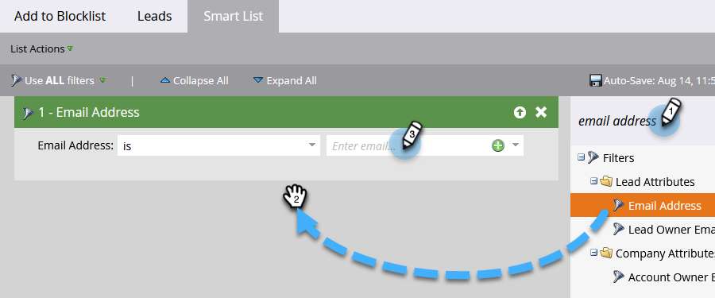

   >[!NOTE]
   >
   >People on your Blocklist will not receive operational emails.

1. Go back to your program.

   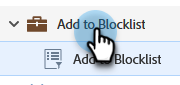

1. Click **New** and select **New Smart Campaign**.

   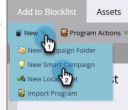

1. Name the **New Smart Campaign**. Click **Create**.

   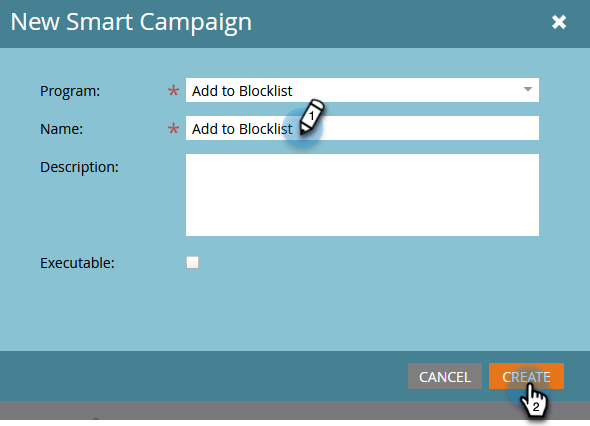

1. Drag and drop **Member of Smart List**.

   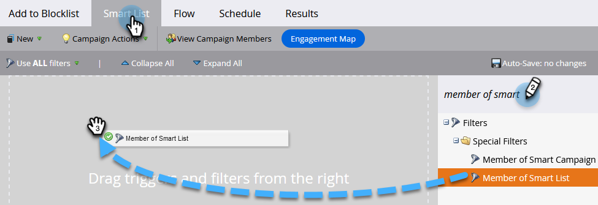

1. Select the smart list you just created.

   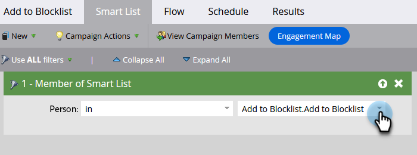

1. Click the **Flow** tab. Drag and drop the **Change Data Value** Flow Action.

   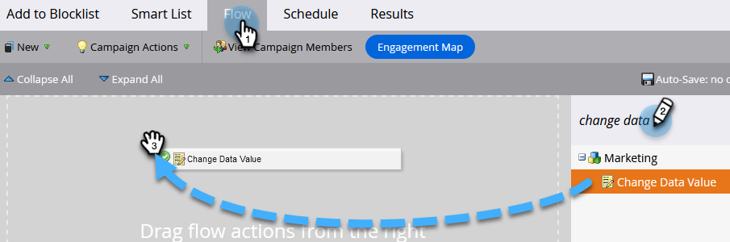

1. In the **Attribute** drop-down select **Block Listed** and set **New Value** to **true**.

   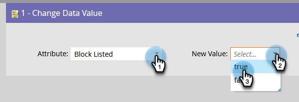

1. Click the **Schedule** tab and select **Run Once**.

   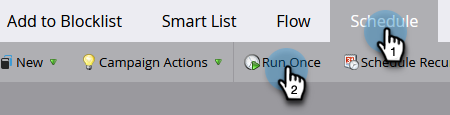

1. Select **Run Now** and click **Run**.

   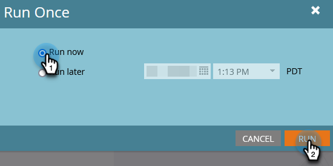

1. Click **Run** again.
   
   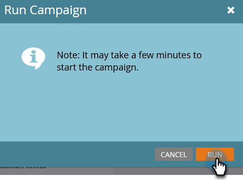
   
These people will no longer receive emails.

   >[!TIP]
   >
   >Create a [trigger smart campaign](/help/marketo/product-docs/core-marketo-concepts/smart-campaigns/creating-a-smart-campaign/create-a-new-smart-campaign.md) using **Change Data Value** with **Block Listed is true** for all people in the future that have blocklist-able attributes.
