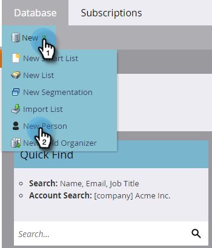

# Create a Person Manually {#create-a-person-manually}

There are many ways to get a person into Marketo Engage. If you need to create one manually, here's how to do it.

   >[!CAUTION]
   >
   >Marketo does not support email addresses that contain emojis.

1. Go to the **[!UICONTROL Database]**.

   

1. Under **[!UICONTROL New]**, click **[!UICONTROL New Person]**.

   

1. Enter the person's information, then click **[!UICONTROL Create]**.

   
