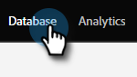
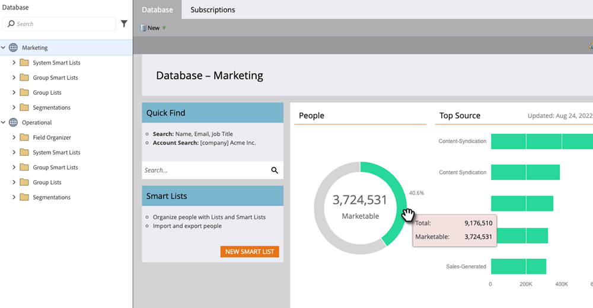

# Database Dashboard {#database-dashboard}

The Database Dashboard serves as a snapshot to help you quickly determine key attributes about your people within a workspace.

>[!NOTE]
>
>Each workspace has its own Database Dashboard.

To get there, select **[!UICONTROL Database]** from your My Marketo.

The graphs indicate total number of people, number of marketable people, as well as your top five person-acquiring sources. Hover over green areas for more details.

>[!TIP]
>
>Want to obtain more specific or timely info on your people? Try a [People Performance Report](/help/marketo/product-docs/reporting/basic-reporting/report-types/people-performance-report.md){target="_blank"}.

**Total People:** The number of all-time people for the workspace listed.

**Marketable People:** The number of all-time people for the workspace listed, _minus the following_: people without an email address, people whose email has hard bounced, people that are blocklisted, people that have unsubscribed, people currently set to Marketing Suspended.
