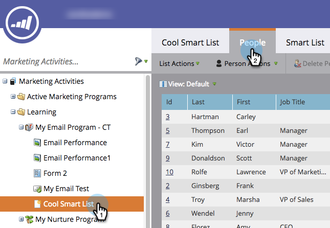
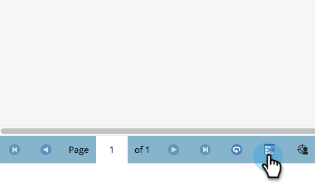
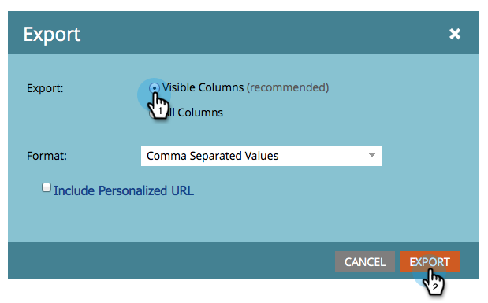

# Export People to Excel from a List or Smart List {#export-people-to-excel-from-a-list-or-smart-list}

If you need list or Smart List results outside of Marketo, you can easily export to Excel. Here's how.

1. Go to **[!UICONTROL Marketing Activities]**.

   

1. Select the list or Smart List you want to export and go to the **[!UICONTROL People]** tab.

   

1. Towards the bottom of the page, click the Excel icon.

   

1. Select **[!UICONTROL Visible Columns]** and click **[!UICONTROL Export]**.

   

   >[!NOTE]
   >
   >If you choose **[!UICONTROL All Columns]**, the export will be larger in size and take longer to generate/download.

   >[!TIP]
   >
   >If your person records contain foreign characters that aren't rendering properly upon export, try changing the file type in the **[!UICONTROL Format]** drop-down.

1. The export will run. Once finished you can click **[!UICONTROL Download now]** to grab the file.

   

   >[!TIP]
   >
   >If the export is taking a while, you can always log out and come back to it later. The **[!UICONTROL Download now]** link can be accessed by selecting **[!UICONTROL Show Export Status]** in the **[!UICONTROL List Actions]** menu, and is valid for one week.
