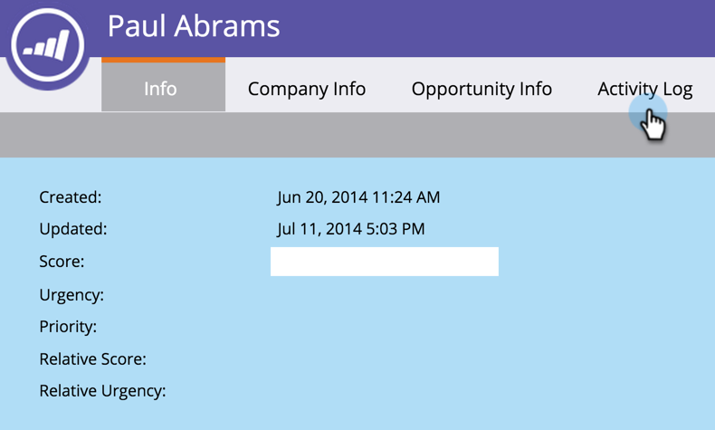
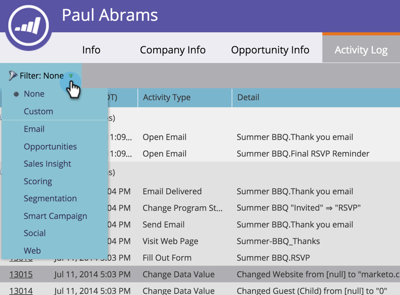
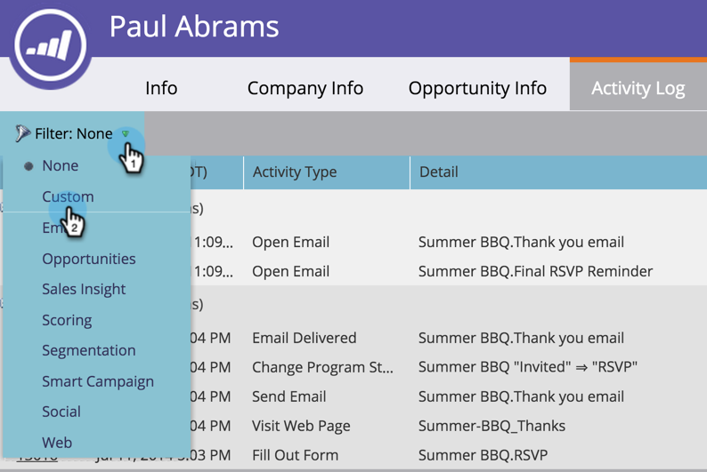
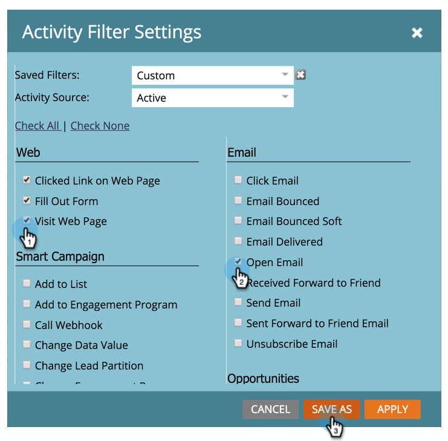

# Filter Activity Types in the Activity Log of a Person {#filter-activity-types-in-the-activity-log-of-a-person}

Search for activities that matter most to you in the activity log.

>[!NOTE]
>
>Learn more about [the activity log](/help/marketo/product-docs/core-marketo-concepts/smart-lists-and-static-lists/managing-people-in-smart-lists/locate-the-activity-log-for-a-person.md).

1. Go to the **[!UICONTROL Person Detail]** page. Click the **[!UICONTROL Activity Log]** tab.

   

1. Select the **Filter** drop-down.

   

## Creating Custom Filters {#creating-custom-filters}

1. Click the **Filter** drop-down. Select **[!UICONTROL Custom]**.

   

1. Select activities to filter by. Click **[!UICONTROL Save As]**.

   

1. Enter a **custom filter name**. Click **[!UICONTROL Save]**.

   

   Now, only person activities that meet the filter's criteria are displayed.

   

## Reference Saved Filters {#reference-saved-filters}

Saved filters can be accessed from the **Filter** drop-down.

1. Click the **Filters** drop-down. Select **[!UICONTROL Custom]**.

   

1. Click **[!UICONTROL Saved Filters]**. Saved filters are listed below.

   
