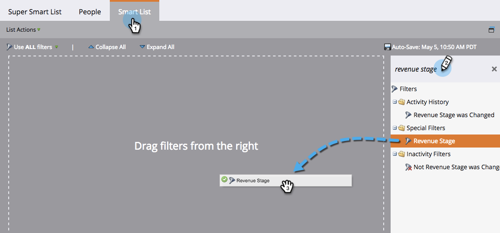
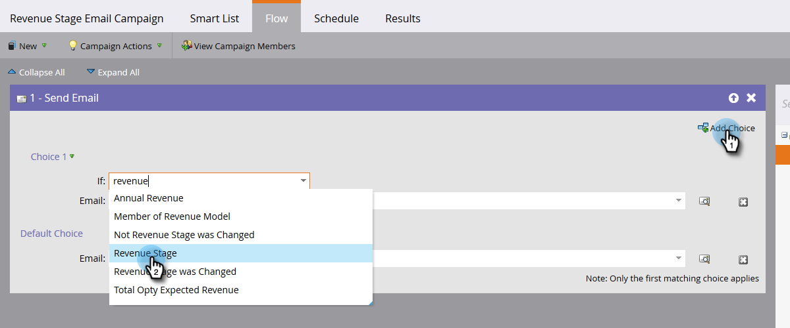

# Find All People in a Revenue Stage {#find-all-people-in-a-revenue-stage}

>[!PREREQUISITES]
>
>* [Create a Smart List](../../../../product-docs/core-marketo-concepts/smart-lists-and-static-lists/creating-a-smart-list/create-a-smart-list.md)
>

## Find All Members of a Specific Revenue Stage {#find-all-members-of-a-specific-revenue-stage}

1. In a smart list, click the **Smart List **tab, find the **Revenue Stage** filter, and drag it into the canvas.

   

1. Select a **Revenue Stage**.

   

1. Go to the **People** tab to view the results.

   

## Run a Flow Step on the Members of a Revenue Stage {#run-a-flow-step-on-the-members-of-a-revenue-stage}

Now that you know which people are in which revenue stages, you can market directly to them. Besides choosing **Revenue Stage** as a smart list filter, you can also choose it as an "if" filter in the flow.

1. In the desired flow step, click **Add Choice** and select **Revenue Stage** from the drop-down.

   

   From there you can choose which members are affected by which aspect of the flow step. Fun!

