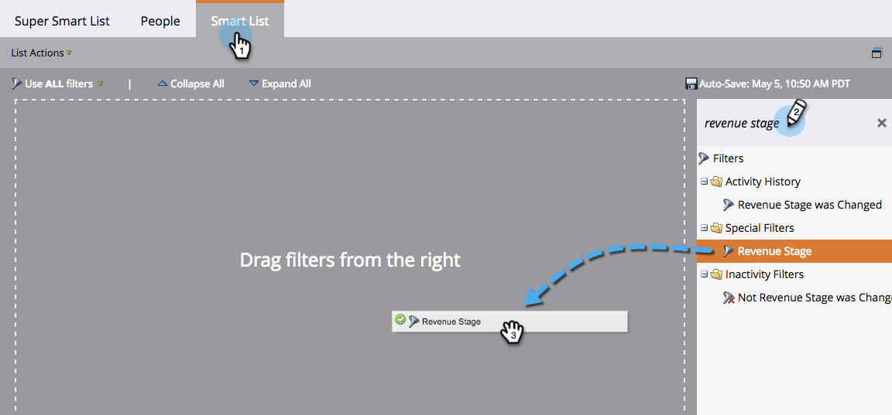
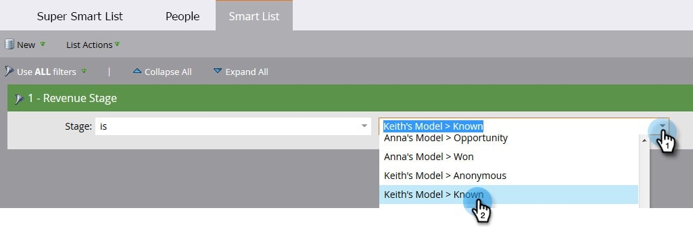
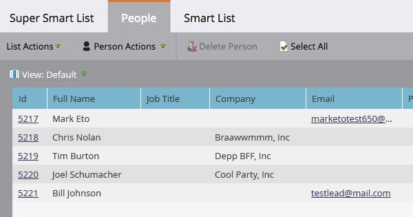

# Find All People in a Revenue Stage {#find-all-people-in-a-revenue-stage}

>[!PREREQUISITES]
>
>[Create a Smart List](/help/marketo/product-docs/core-marketo-concepts/smart-lists-and-static-lists/creating-a-smart-list/create-a-smart-list.md){target="_blank"}

## Find All Members of a Specific Revenue Stage {#find-all-members-of-a-specific-revenue-stage}

1. In a Smart List, click the **[!UICONTROL Smart List]** tab, find the **[!UICONTROL Revenue Stage]** filter, and drag it into the canvas.

   

1. Select a **[!UICONTROL Revenue Stage]**.

   

1. Go to the **[!UICONTROL People]** tab to view the results.

   

## Run a Flow Step on the Members of a Revenue Stage {#run-a-flow-step-on-the-members-of-a-revenue-stage}

Now that you know which people are in which revenue stages, you can market directly to them. Besides choosing **[!UICONTROL Revenue Stage]** as a Smart List filter, you can also choose it as an "if" filter in the flow.

1. In the desired flow step, click **[!UICONTROL Add Choice]** and select **[!UICONTROL Revenue Stage]** from the drop-down.

   

   From there you can choose which members are affected by which aspect of the flow step.
