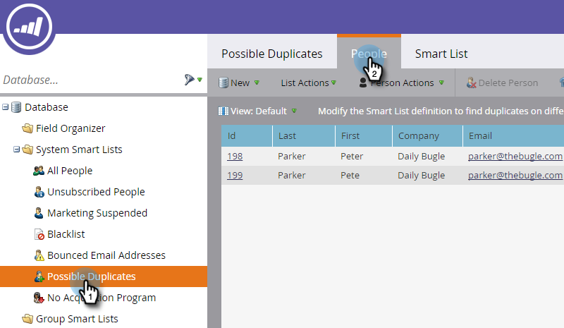
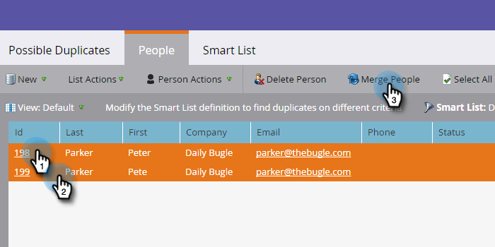

# Find and Merge Duplicate People {#find-and-merge-duplicate-people}

Marketo automatically de-duplicates when new people enter the system. However, your CRM may have initially sent duplicates to Marketo. Here's how to merge them.

>[!NOTE]
>
>**FYI**
>
>Marketo is now standardizing language across all subscriptions, so you may see lead/leads in your subscription and person/people in docs.marketo.com. These terms mean the same thing; it does not affect article instructions. There are some other changes, too. [Learn more](http://docs.marketo.com/display/DOCS/Updates+to+Marketo+Terminology).

>[!NOTE]
>
>Marketo will not automatically de-dupe against a Salesforce or Microsoft Dynamics sync, or when you manually enter people.

>[!PREREQUISITES]
>
>Finding and merging duplicates will involve the use of [built-in / system smart lists](../../../../product-docs/core-marketo-concepts/smart-lists-and-static-lists/using-smart-lists/use-built-in-system-smart-lists.md).

## Find Duplicates {#find-duplicates}

1. Go to the **Database** area.

   

   >[!CAUTION]
   >
   >Merging people in Marketo may not work if you use a Salesforce Person Account. Please merge the records in Salesforce if possible.

1. Select the **Possible** **Duplicates** system smart list and click on the **People** tab.

   

   >[!NOTE]
   >
   >You can also [Find Duplicate People with Custom Logic](find-duplicate-people-with-custom-logic.md).

## Merge People Manually {#merge-people-manually}

   >[!CAUTION]
   >
   >When merging people, if the losing person has a Marketo custom object, it will **not** get re-associated to the winning person. Please re-parent the custom object prior to performing the merge.

   Select the duplicates by holding Ctrl/Cmd and clicking, then click Merge People.
   

   >[!TIP]
   >
   >You could have two or more duplicates for the same person - select them all at once.

1. You will see the values between the records that *don't* match. Select the value you want to keep for each field. Click **Merge** when done. If you don't want either value, you can check **Custom** and enter a value of your choice.

   

   >[!NOTE]
   >
   >When manually merging people, the first person selected will be the "winner." So in the People tab if you are merging record IDs 198 and 199, and you happen to click on 199 first, 199 will be the record ID of the merged people. This also applies if more than two records are merged.

   >[!TIP]
   >
   >Merging is better than deleting. You'll conserve all history (page visits, link clicks, email opens, form fills, etc.).

## Effect in Salesforce {#effect-in-salesforce}

   If you have Salesforce integration, there are a few notes about the effect of Merge Leads in Salesforce.

    * When merging only Leads or only Contacts, they merge per normal Salesforce rules.
    * When merging Leads and Contacts together, all Leads are converted to Contacts prior to merging per normal Salesforce rules.

   For specifics of Salesforce behavior when merging Leads or Contacts, please check the following Salesforce documents:

    * [Merging Duplicate Leads](https://help.salesforce.com/HTViewHelpDoc?id=leads_merge.htm&language=en_US)
    * [Merging Duplicate Contacts](https://help.salesforce.com/HTViewHelpDoc?id=contacts_merge.htm&language=en_US)

## Bulk Merging {#bulk-merging}

   If you have too many duplicates to manually merge, contact your Customer Success Manager to discuss your options.

Super! If you are connected to a CRM the records will merge there according to the rules below. 