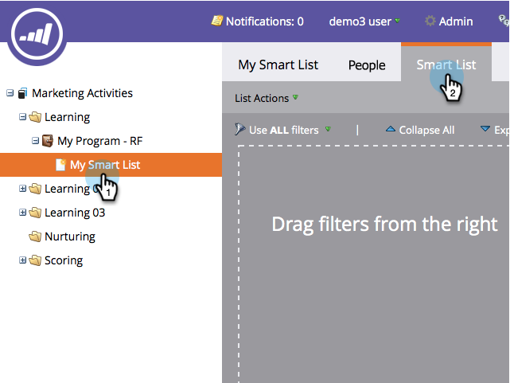
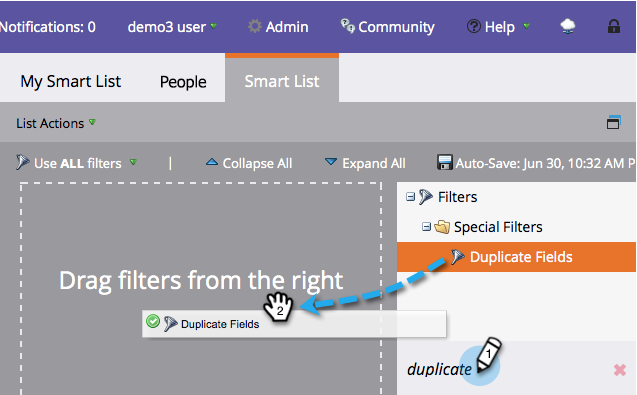

# Find Duplicate People with Custom Logic {#find-duplicate-people-with-custom-logic}

Marketo has a system smart list that finds duplicate people by matching their email addresses. If you want to use another field to find duplicates with, here's how.

>[!PREREQUISITES]
>
>[Create a Smart List](/help/marketo/product-docs/core-marketo-concepts/smart-lists-and-static-lists/creating-a-smart-list/create-a-smart-list.md)

1. Go to the **Marketing Activities** area.

1. Select your smart list, click on the **Smart List** tab.

   

1. Find and drag the **Duplicate Fields** filter onto the canvas.

   

1. Choose one of four available options:

    * Email Address
    * Full Name
    * Last Name
    * Updated At

    >[!NOTE]
    >
    >All fields, with the exception of Email Address, are case-sensitive. So using "john doe" in the Full Name field would _not_ return results for John Doe.

   

   Done! Run the smart list to find people with the same value in the previously selected field.
