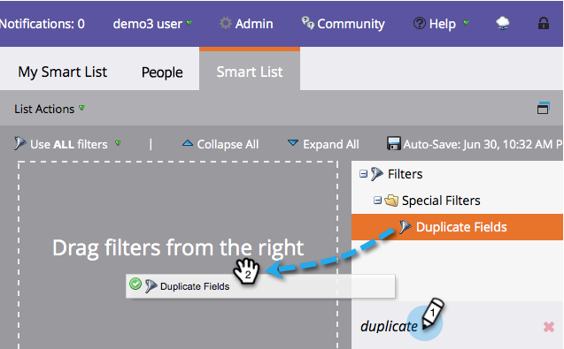

# Find Duplicate People with Custom Logic {#find-duplicate-people-with-custom-logic}

Marketo Engage has a System Smart List that finds duplicate people by matching their email addresses. If you want to use another field to find duplicates with, follow the steps below.

>[!PREREQUISITES]
>
>[Create a Smart List](/help/marketo/product-docs/core-marketo-concepts/smart-lists-and-static-lists/creating-a-smart-list/create-a-smart-list.md){target="_blank"}

1. Go to the **[!UICONTROL Marketing Activities]** area.

1. Select your Smart List, click on the **[!UICONTROL Smart List]** tab.

   

1. Find and drag the **[!UICONTROL Duplicate Fields]** filter onto the canvas.

   

1. Choose one of four available options:

    * [!UICONTROL Email Address]
    * [!UICONTROL Full Name]
    * [!UICONTROL Last Name]
    * [!UICONTROL Updated At]

    >[!NOTE]
    >
    >All fields, with the exception of Email Address, are case-sensitive. So using "john doe" in the Full Name field would _not_ return results for John Doe.

   

   Run the Smart List to find people with the same value in the previously selected field.
