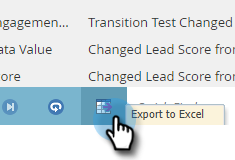
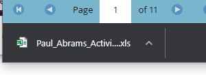

# Locate the Activity Log for a Person {#locate-the-activity-log-for-a-person}

The activity log is the ultimate source of truth. This is the complete story of a person's journey in Marketo Engage.

1. Go to the **[!UICONTROL Database]**.

   

1. Select **[!UICONTROL All People]**.

   

1. Click the **[!UICONTROL People]** tab. Select a person **[!UICONTROL Id]** number.

   

1. Click **[!UICONTROL Activity Log]**.

   

   You now have a collection of all the information that happens over time for a person.

   

## Export Activity Log {#export-activity-log}

Need to export a person's activity log to Excel?

1. After following the steps above, scroll to the bottom of the page and select the Export icon.

   

1. An Excel file downloads to your browser.

   

   >[!MORELIKETHIS]
   >
   >Learn more about [filtering the activity log](/help/marketo/product-docs/core-marketo-concepts/smart-lists-and-static-lists/managing-people-in-smart-lists/filter-activity-types-in-the-activity-log-of-a-person.md){target="_blank"} to see specific person activities.
