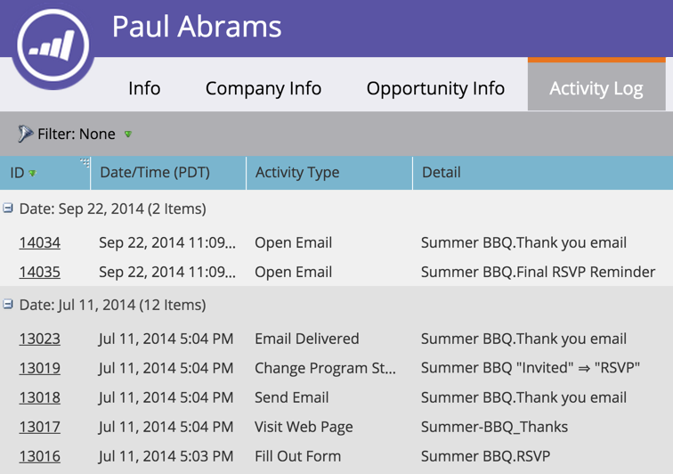

# Locate the Activity Log for a Person {#locate-the-activity-log-for-a-person}

The activity log is the ultimate source of truth. This is the complete story of a person's journey in Marketo.

>[!NOTE]
>
>**FYI**
>
>Marketo is now standardizing language across all subscriptions, so you may see lead/leads in your subscription and person/people in docs.marketo.com. These terms mean the same thing; it does not affect article instructions. There are some other changes, too. [Learn more](http://docs.marketo.com/display/DOCS/Updates+to+Marketo+Terminology).

1. Go to the** Database**.

   

1. Select **All People**.

   

1. Click the **People** tab. Select a person **Id** number.

   

1. Click **Activity Log**.

   

   Behold. The activity log! This is a collection of all the information that happens over time for a person.

   

   >[!NOTE]
   >
   >**Related Articles**
   >
   >
   >Learn more about [filtering the activity log](filter-activity-types-in-the-activity-log-of-a-person.md)to see specific person activities.

