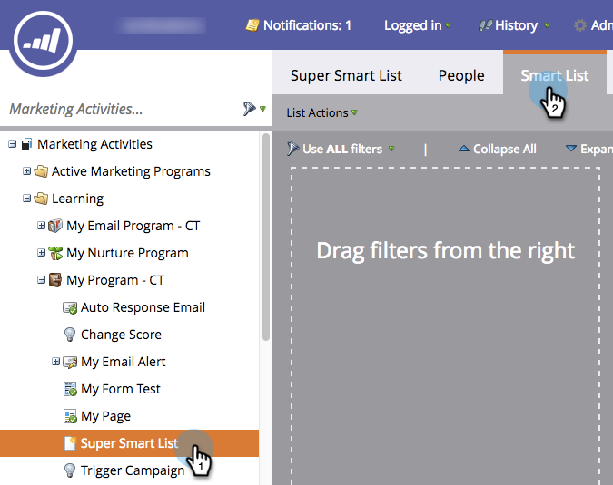
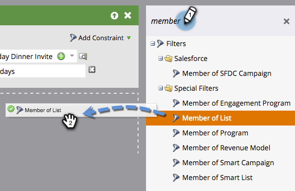
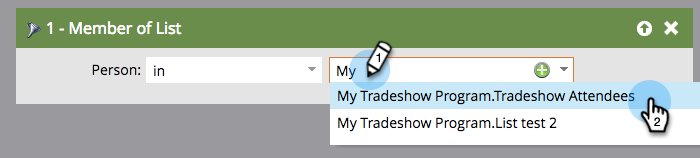

# Use Members of List in a Smart List {#use-members-of-list-in-a-smart-list}

>[!TIP]
>
>You can add people to a list using [Import](/help/marketo/getting-started/quick-wins/import-a-list-of-people.md) or the [Add to List flow step](/help/marketo/product-docs/core-marketo-concepts/smart-campaigns/flow-actions/add-to-list.md).

With this filter, you can pull members from another list by referring to it in your smart list rules. Here's how.

1. Select a smart list and click the **[!UICONTROL Smart List]** tab.

   

1. On the right side filters panel, search for and drag the **[!UICONTROL Member of List]** filter onto the canvas.

   

1. Click the drop-down or type to search for the list that you want to include within your smart list.

   

   Done! In this example, the smart list will now target only members of that list and evaluate them based on any other rules you include.
