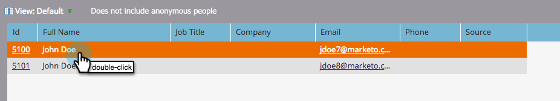
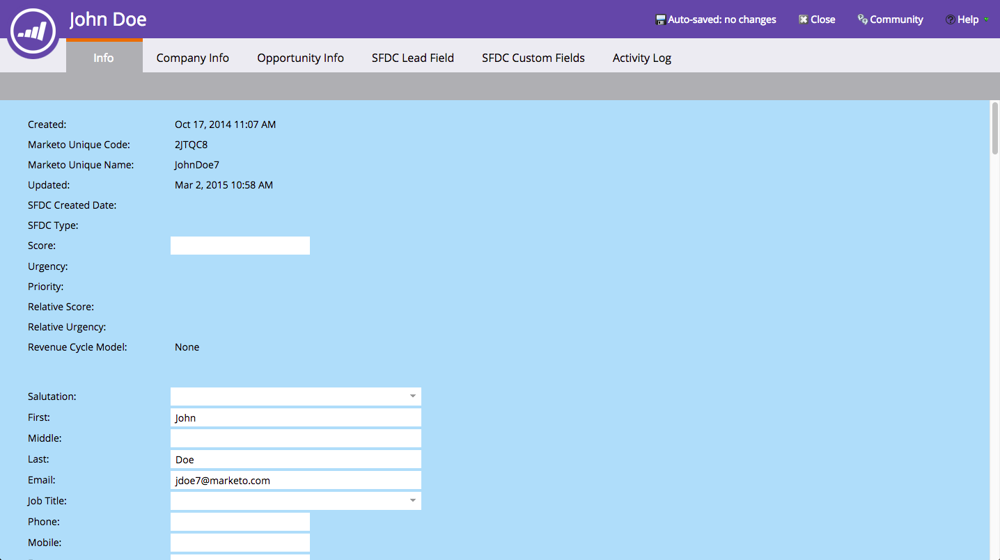
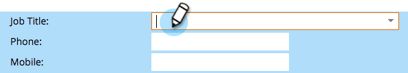

# Using the Person Detail Page {#using-the-person-detail-page}

The person detail page contains all the information Marketo knows about a person. You can edit data directly from this page.

>[!NOTE]
>
>**FYI**
>
>Marketo is now standardizing language across all subscriptions, so you may see lead/leads in your subscription and person/people in docs.marketo.com. These terms mean the same thing; it does not affect article instructions. There are some other changes, too. [Learn more](http://docs.marketo.com/display/DOCS/Updates+to+Marketo+Terminology).

#### Getting to Person Detail Page {#getting-to-person-detail-page}

There are lots of ways to open specific people. Some examples are listed below.

>[!NOTE]
>
>**Example**
>
>* From the **Database**, you can search in the Quick Find
>* Any smart **list** or list
>* **Members** tab of a program
>* **View Campaign Members** in a Smart Campaign
>* Some **reports**
>

1. Either double-click on any person or single-click the ID on the left.

   

1. This will open the person detail screen.

   

#### Page Organization - Salesforce {#page-organization-salesforce}

Person information is categorized into the following tabs:

| Tab |Description |
|---|---|
| Info |Contact information and custom fields about a person. |
| Company Info |Person's company information and address. |
| Opportunity Info |Opportunity information synced from Salesforce. |
| SFDC Lead Field |Built-in Salesforce fields. |
| SFDC Custom Field |Custom Salesforce fields. |
| Activity Log |All activities related to the person. |

#### Page Organization - Microsoft Dynamics {#page-organization-microsoft-dynamics}

| Tab |Description |
|---|---|
| Info |Contact information and custom fields about a person. |
| Company Info |Person's company information and address. |
| Opportunity Info |Opportunity information synced from Microsoft. |
| Microsoft Custom Fields |Custom Microsoft fields. |
| Microsoft Lead Field |Built-in Microsoft fields. |
| Activity Log |All activities related to the person. |

#### Editing a Field {#editing-a-field}

Many fields are editable. To update a person's information, type in a new value and click outside the field to save.

#### Marketo Default Fields Prior to CRM Sync {#marketo-default-fields-prior-to-crm-sync}

|   |  |  |  |  |
|---|---|---|---|---|
| Address |Annual Revenue |Anonymous IP |Billing Address |Billing City |
| Billing Country |Billing Postal Code |Billing State |City |Company Name |
| Country |Created At |Date of Birth |Department |Do Not Call |
| Do Not Call Cause |Do Not Call Reason |Email Address |Email Invalid |Email Invalid Cause |
| External Company Id |External Sales Person Id |Fax Number |First Name |Full Name |
| Industry |Inferred City |Inferred Company |Inferred Country |Inferred Metropolitan Area |
| Inferred Phone Area Code |Inferred Postal Code |Inferred State Region |Is Anonymous |Is Customer |
| Is Partner |Job Title |Last Name |Rating |Score |
| Person Source |Status |Main Phone |Marketo Social Facebook Display Name |Marketo Social Facebook Id |
| Marketo Social Facebook Photo URL |Marketo Social Facebook Profile URL |Marketo Social Facebook Reach |Marketo Social Facebook Referred Enrollments |Marketo Social Facebook Referred Visits |
| Marketo Social Gender |Marketo Social Last Referred Enrollment |Marketo Social Last Referred Visit |Marketo Social LinkedIn Display Name |Marketo Social LinkedIn Id |
| Marketo Social LinkedIn Photo URL |Marketo Social LinkedIn Profile URL |Marketo Social LinkedIn Reach |Marketo Social LinkedIn Referred Enrollments |Marketo Social LinkedIn Referred Visits |
| Marketo Social Syndication ID |Marketo Social Total Referred Enrollments |Marketo Social Total Referred Visits |Marketo Social Twitter Display Name |Marketo Social Twitter Id |
| Marketo Social Twitter Photo URL |Marketo Social Twitter Profile URL |Marketo Social Twitter Reach |Marketo Social Twitter Referred Enrollments |Marketo Social Twitter Referred Visits |
| Middle Name |Mobile Phone Number |Num Employees |Phone Number |Postal Code |
| Priority |Relative Score |Role |Salutation |SIC Code |
| Site |State |Unsubscribed |Unsubscribed Reason |Updated At |
| Urgency |Website |  |  |  |

>[!NOTE]
>
>**Deep Dive**
>
>Some fields are *not* editable:
>
>* Company Information
>* Opportunities for SFDC Contacts
>* Certain Marketo-specific fields, such as Created Date and Original Source Type.
>* Activity Log
>
>Learn more about [System Managed Fields](../../../../product-docs/administration/field-management/understanding-system-managed-fields.md).

>[!NOTE]
>
>**Related Articles**
>
>* [Creating a Custom Tab for the Person Detail Page](../../../../product-docs/administration/settings/creating-a-custom-tab-for-the-person-detail-page.md)
>

