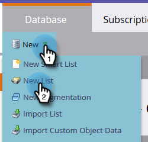

# Create a Static List {#create-a-static-list}

Static lists are a group of people already in your Database. Here's how to create one.

1. Go to **[!UICONTROL Database]**.

   

1. Click the **[!UICONTROL New]** drop-down and select **[!UICONTROL New List]**.

   

1. Choose a destination folder, give your new list a name, then click **[!UICONTROL Create]**.

   

   You now have an empty list ready to be filled. Learn how to add people [here](/help/marketo/product-docs/core-marketo-concepts/smart-lists-and-static-lists/static-lists/understanding-static-lists.md#ways-to-add-remove-people-from-a-list).

   >[!NOTE]
   >
   >You can add a person to your list as many times as you like, but they'll only appear once. People remain in the list until you remove them.
