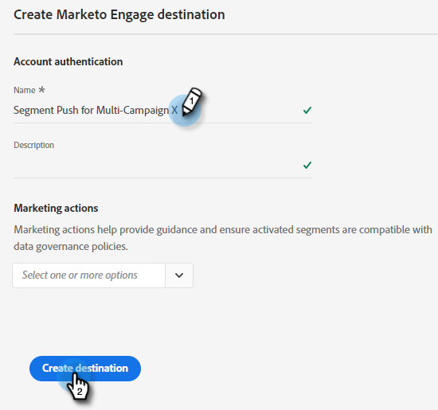

# Push an Adobe Experience Cloud Segment to a Marketo Static List {#push-an-adobe-experience-cloud-segment-to-a-marketo-static-list}

This feature allows you to push segments located in your Adobe Experience Platform over to Marketo in the form of a static list.

>[!PREREQUISITES]
>
>* [Create an API User](/help/marketo/product-docs/administration/users-and-roles/create-an-api-only-user.md) in Marketo.
>* Then, go to **Admin** > **Launchpoint**. Find the name of the role you just created and click **View Details**. Copy and save the info in **Client ID** and **Client Secret**, as you'll need it for this feature.

1. Log in to [Adobe Experience Platform](https://experience.adobe.com/).

   

1. Click the grid icon and select **Experience Platform**.

   

1. In the left nav, click **Destinations**.

   

1. Click **Catalog**.

   

1. Find the Marketo Engage tile and click **Activate**.

   

1. Under Account Type, click the **New Account** radio button. Enter your Marketo credentials and click **Connect to Destination**.

   

   >[!NOTE]
   >
   >You can find your Munchkin ID by going to **Admin** > **Munchkin** (it's also part of your Marketo URL once logged in). Client ID/Secret you should have from following the prerequisites at the top of this article.

1. "Connected" should appear below your credentials. Click **Next** in the upper right-hand corner.

   

1. Enter a **Name** and an _optional_ Description. Click **Create Destination**.

   >[!NOTE]
   >
   >Choosing something from Marketing Actions is also optional. Marketo doesn't leverage that information at this time, but likely will soon.

   

1. Click **Next**.

   

1. Choose your desired segment and click **Next**.

   

   >[!NOTE]
   >
   >Segments to static lists are 1:1. If you choose multiple segments here, you'll have to map each segment to a specified static list in the Segment Schedule tab.

1. Click **Add New Mapping**.

   

1. Click the cursor icon.

   

1. Choose either the **Select Attributes** or **Select Identity Namespace** radio button (in this example, we're choosing Attributes).

   

   >[!NOTE]
   >
   >If you chose **Select Identity Namespace**, after making your selection, skip to Step 15.

1. Choose the relevant field that contains the email address that identifies the user. Click **Select** when done.

   

   

   >[!NOTE]
   >
   >The example we've chosen may look much different than your selection.

1. Click the mapping icon.

   

1. Choose your Target Field and click **Select**.

   

1. Click **Next**.

   

1. _In Marketo_, create a static list, or find and select one you've already created. Copy the mapping ID from the end of the URL.

   

   >[!NOTE]
   >
   >For best results, make sure the list you reference in Marketo is empty.

1. Back in Adobe Experience Platform, enter the ID you just copied. Choose your Start Date. People will continuously sync until the chosen end date. For an indefinite sync, leave the end date blank. Click **Next** when done.

   

1. Confirm your changes and click **Finish**.

   
