# Push Clone {#push-clone}

This feature allows you to push segments located in your Adobe Experience Platform over to Marketo in the form of a static list.

>[!PREREQUISITES]
>
>* [Create an API User](/help/marketo/product-docs/administration/users-and-roles/create-an-api-only-user.md) in Marketo.
>* Then, go to **Admin** > **Launchpoint**. Find the name of the role you just created and click **View Details**. Copy and save the info in **Client ID** and **Client Secret**, as you'll need it for this feature.
>* In Marketo, create a static list, or find and select one you've already created. You'll need its ID.

1. Log in to [Adobe Experience Platform](https://experience.adobe.com/).

   

1. Click the grid icon and select **Experience Platform**.

   

1. In the left nav, click **Destinations**.

   

1. Click **Catalog**.

   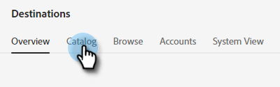

1. Find the Marketo Engage tile and click **Activate Segments**.

   

1. Click **Configure New Destination**.

   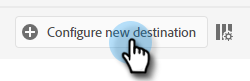

1. Under Account Type, select the Existing or New Account radio button (in this example, we're choosing **Existing Account**). Click the Select Account icon.

   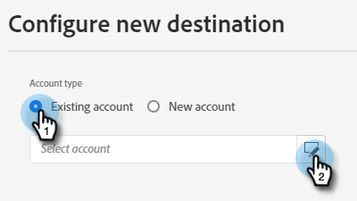

1. Choose the destination account and click **Select**.

   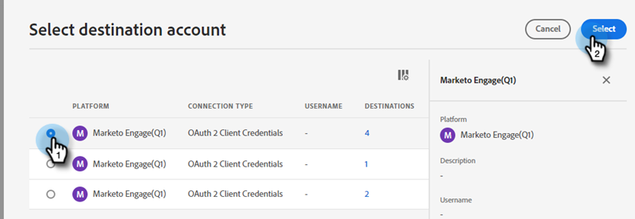

1. Enter a Destination **Name** and an optional Description. Click the Person Creation drop-down and choose "Match Existing Marketo People and Create Missing People in Marketo" _or_ "Match Existing Marketo People Only." In this example we're choosing the former.

   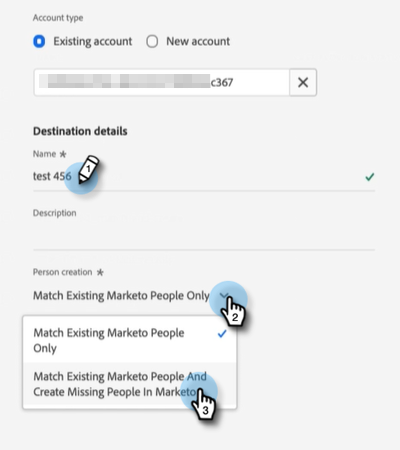

   >[!NOTE]
   >
   >If you choose "Match Existing Marketo People Only" you'll only need to map the Email and/or ECID, so you can skip Steps 13-16.

1. This section is optional. Click **Create** to skip.

   

1. Select the destination you created and click **Next**.

   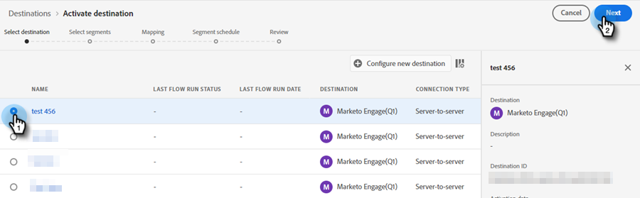

1. Choose the segment you want to send to Marketo and click **Next**.

   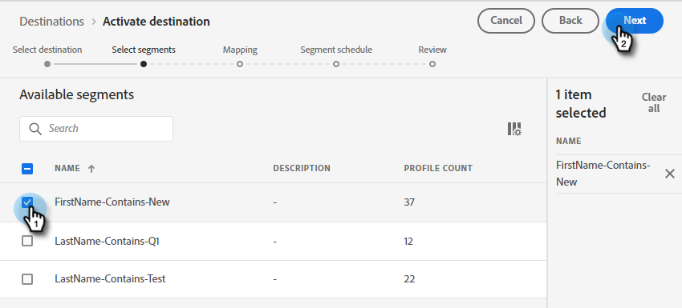

1. Click **Add New Mapping**.

   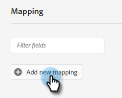

1. Click the mapping icon.

   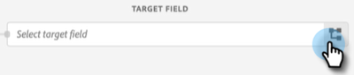

1. Map First Name by selecting **firstName** and clicking **Select**.

   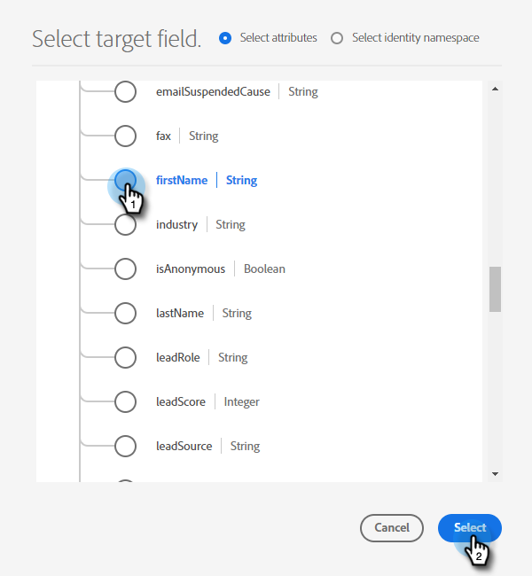

1. Map the Last Name and Company Name by clicking **Add New Mapping** again and repeating Step 15 twice, choosing **lastName** and then **companyName**.

   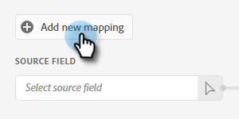

1. Now it's time to map the email address. Click **Add New Mapping** again.

   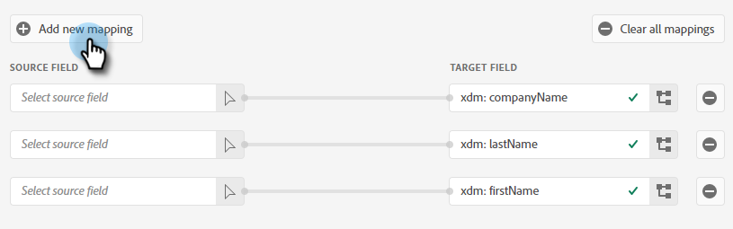

1. Click the mapping icon.

   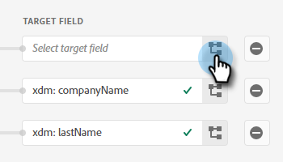

1. Click the Select Identity Namespace radio button, choose  **Email**, then click **Select**.

   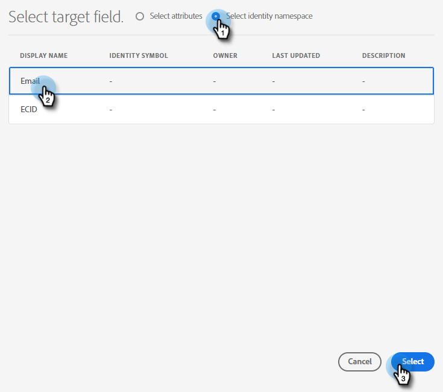

1. Now it's time to choose the source fields. For email, click the cursor icon.

   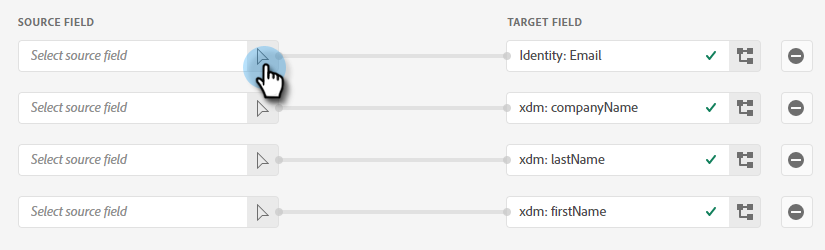

1. Click the Select Identity Namespace radio button, find and select **Email**, then click **Select**.

   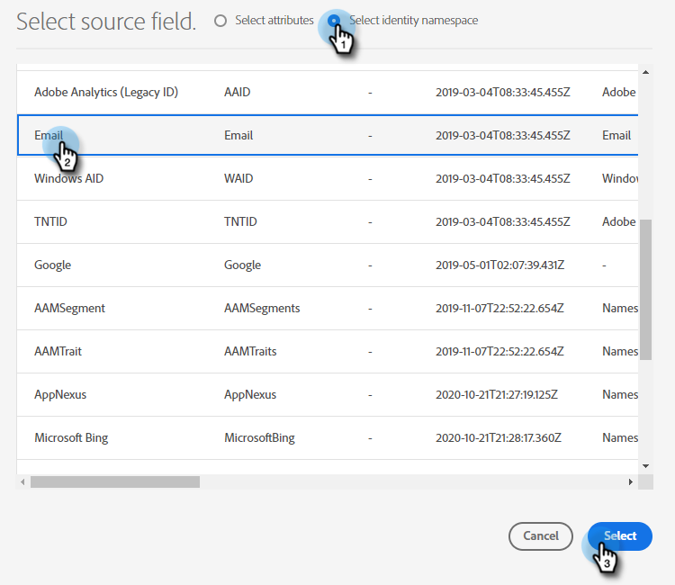

1. To choose the Company Name source field, click the cursor icon in its row.

   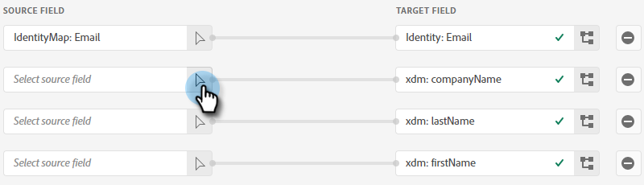

1. Leave the Select Attribute radio button checked. Search for "company" and select **companyName**, then click **Select**.

   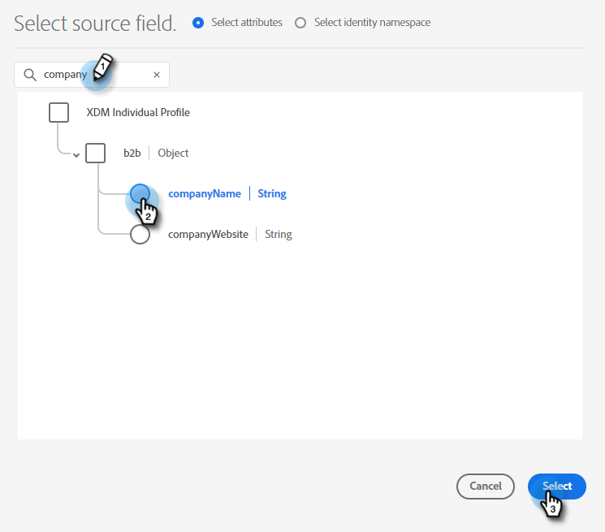

1. Map the source fields for Last Name and First Name by clicking the cursor icon for each and repeating Step 23 twice, choosing **lastName** and then **firstName**.

   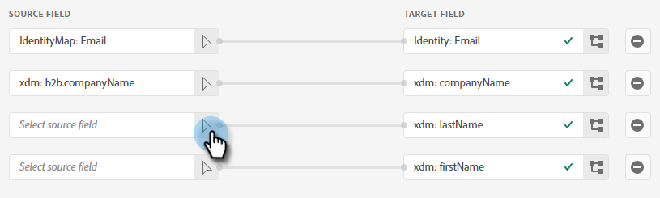

1. Click **Next**.

   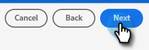

1. You will now need your list's ID. Click the tab in your browser that has your Marketo static list open (or open a new tab and select your desired static list).

   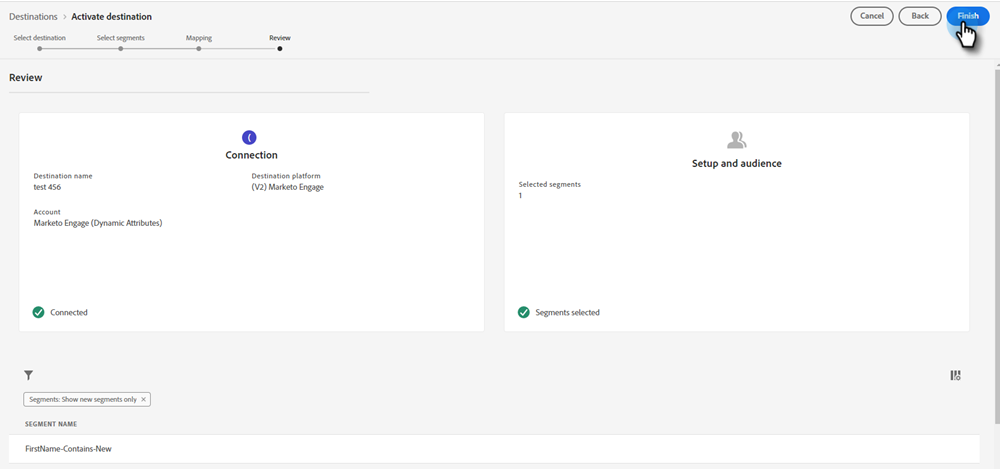

1. Highlight and copy the list ID at the end of the URL.

   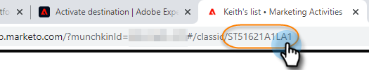

1. Paste the ID you just copied under Mapping ID and click **Next**.

   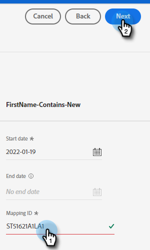

1. Click **Finish**.

   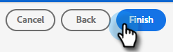
