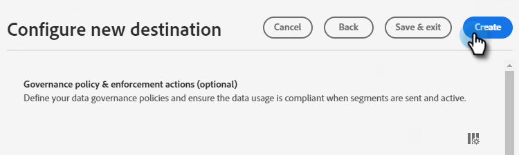

# Push Clone {#push-clone}

This feature allows you to push segments located in your Adobe Experience Platform over to Marketo in the form of a static list.

>[!PREREQUISITES]
>
>* [Create an API User](/help/marketo/product-docs/administration/users-and-roles/create-an-api-only-user.md) in Marketo.
>* Then, go to **Admin** > **Launchpoint**. Find the name of the role you just created and click **View Details**. Copy and save the info in **Client ID** and **Client Secret**, as you'll need it for this feature.

1. Log in to [Adobe Experience Platform](https://experience.adobe.com/).

   

1. Click the grid icon and select **Experience Platform**.

   

1. In the left nav, click **Destinations**.

   

1. Click **Catalog**.

   

1. Find the Marketo Engage tile and click **Activate Segments**.

   

1. Click **Configure New Destination**.

   

1. Under Account Type, select the Existing or New Account radio button (in this example, we're choosing **Existing Account**). Click the Select Account icon.

   

1. Choose the destination account and click **Select**.

   

Next you'll have to choose whether you want to match existing Marketo people only, or match existing Marketo people and create the missing people in Marketo. Below are sections that outline how to do each.

## Match Existing Marketo People and Create Missing People in Marketo {#match-existing-marketo-people-create-missing-people}

After following Steps 1-8 from above...

1. Enter a Destination **Name** and an optional Description. Click the Person Creation drop-down and select **Match Existing Marketo People and Create Missing People in Marketo**.

   

1. This section is optional. Click **Create** to skip.

   

1. Select the destination you created and click **Next**.

   

1. Choose the segment you want to send to Marketo and click **Next**.

   

1. Click **Add New Mapping**.

   

1. Click the mapping icon.

   

1. Map First Name by selecting **firstName** and clicking **Select**.

   

1. Map the Last Name and Company name by clicking **Add New Mapping** again and repeating Step 7 twice, choosing lastName and then companyName.

   

1. Now it's time to map the email address. Click **Add New Mapping** again.

   

1. Click the mapping icon.

   

1. Click the Select Identity Namespace radio button, choose  **Email**, then click **Select**.

   

1. Now it's time to choose the source fields. For email, click the cursor icon.

   

1. Click the Select Identity Namespace radio button, find and select **Email**, then click **Select**.

   

MORREEEE

## Match Existing Marketo People Only {#match-existing-marketo-people-only}

   >[!NOTE]
   >
   >Identities are used to look for matches in Marketo. If a match is found, the person is added to the static List. If a match is not found, those people are dropped (i.e., not created in Marketo).

1. _In Marketo_, create a static list, or find and select one you've already created. Copy the mapping ID from the end of the URL.

PICC

   >[!NOTE]
   >
   >For best results, make sure the list you reference in Marketo is empty.

1. Back in Adobe Experience Platform, enter the ID you just copied. Choose your Start Date. People will continuously sync until the chosen end date. For an indefinite sync, leave the end date blank. Click **Next** when done.

PICC

1. Confirm your changes and click **Finish**.

PICC
