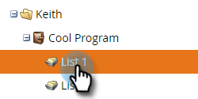
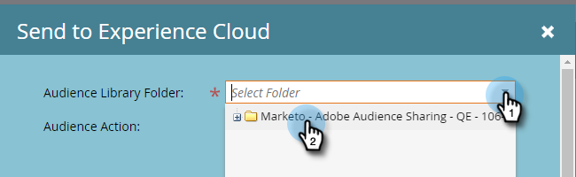
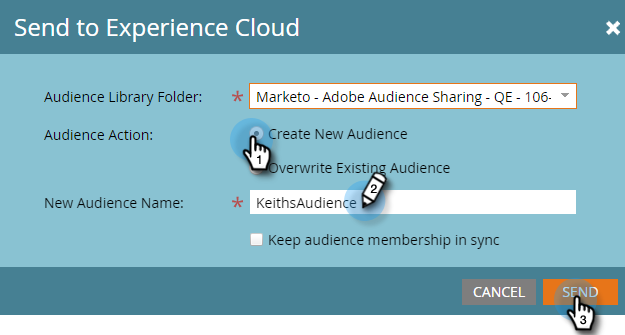
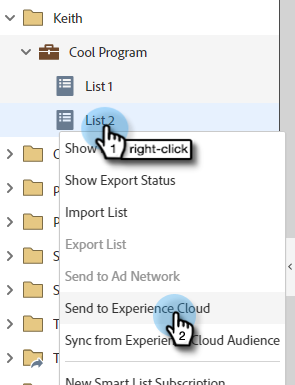
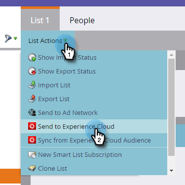
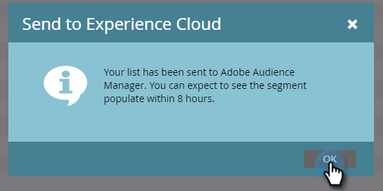
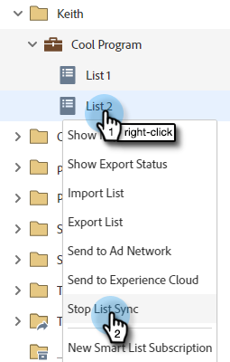
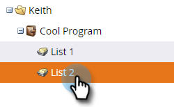

# Send a List to Adobe Experience Cloud {#send-a-list-to-adobe-experience-cloud}

>[!NOTE]
>
>A HIPAA-ready deployment of a Marketo instance cannot use this feature.

>[!PREREQUISITES]
>
>[Set Up Adobe Organization Mapping](/help/marketo/product-docs/core-marketo-concepts/miscellaneous/set-up-adobe-organization-mapping.md)

## Supported Destination Applications {#supported-destination-applications}

* Adobe Advertising Cloud
* Adobe Analytics (**only** if you own an Adobe Audience Manager License)
* Adobe Audience Manager
* Adobe Experience Manager
* Adobe Real-Time Customer Data Platform
* Adobe Target

## How to Send a Static List {#how-to-send-a-static-list}

A static list is just that, static. No changes will occur to the list in Adobe Experience Cloud unless you manually make them.

1. In Marketo, find the list you want to export. Right-click on it and select **Send to Experience Cloud**.

   

1. Click the **Audience Manager Folder** drop-down and select the desired destination folder in the Experience Cloud.

   

1. Choose whether to create a new audience or overwrite an existing one (in this example we're creating a new one). Enter the new audience name and click **Send**.

   

1. Click **OK**.

   

   >[!NOTE]
   >
   >It can take up to 6-8 hours for audience membership to fully populate in Adobe.

## How to Send a Synced List {#how-to-send-a-synced-list}

Syncing a list means any time you update a list in Marketo, that change automatically syncs over to its audience in Adobe Experience Cloud.

1. In Marketo, find the list you want to export. Right-click on it and select **Send to Experience Cloud**.

   

1. Click the **Audience Library Folder** drop-down and select the desired destination folder in the Experience Cloud.

   

1. Choose whether to create a new audience or overwrite an existing one (in this example we're creating a new one). Enter the new audience name, check the **Keep Audience Membership in Sync** box, and click **Send**.

   

1. Click **OK**.

   

## How to Stop a List Sync {#how-to-stop-a-list-sync}

You can stop your list from syncing at any time.

1. In Marketo, find and right-click on the list you want to stop syncing. Click **Stop List Sync**.

   

1. Select the audience(s) you want to stop being synced and click **Stop**.

   

1. Click **Stop** to confirm.

   

## Things to Note {#things-to-note}

**Sharing to Adobe Analytics**

For customers that own both Adobe Audience Manager and Adobe Analytics, this integration will enable audiences to be shared from Marketo to your Adobe Analytics Report Suites, however there are some additional configurations steps that need to be taken in Adobe Audience Manager to enable this. Please review Adobe Audience Manager’s documentation for more information on how to set this up: [https://experienceleague.adobe.com/docs/analytics/integration/audience-analytics/mc-audiences-aam.html](https://experienceleague.adobe.com/docs/analytics/integration/audience-analytics/mc-audiences-aam.html).

**Trait Usage for Adobe Audience Manager Customers**

When you initiate a list export in Marketo, you'll notice the following changes reflected in your Adobe Audience Manager instance:

* For all of the Leads in the exported List, Marketo will write a trait using the Leads’ hashed emails as a Cross-Device Identifier. The name of the trait will match the Destination Audience Name that you specified during the export.
* For all of the ECIDs that Marketo has managed to match to the Leads in the exported List, Marketo will write a trait using the ECID Device Identifier. The name of the trait will match the Destination Audience Name that you specified during the export.
* Marketo will also create a segment in your Audience Manager Instance using the ECID trait as the sole segmentation criterion. The name of the segment will match the Destination Audience Name that you specified during the export.

## FAQ {#faq}

**Why is the list size in Marketo different than the one in Adobe?**

Under the hood, the audience integration works by syncing Marketo Munchkin cookies with the corresponding Adobe ECID cookie. Marketo can only share membership data for leads that Marketo has synced an ECID for. For the best possible results, it’s recommended that you load Marketo’s munchkin.js tracking script in parallel with Adobe’s visitor.js tracking code on all of the pages you’re interested in tracking for marketing purposes.

**How does the cookie sync work?**

When the cookie sync is enabled for your Marketo Subscription, Marketo’s munchkin.js will attempt to capture and store Adobe ECIDs for the Adobe IMS Org you specified during the integration setup and match these ECIDs to the corresponding Marketo cookie identifier. This enables Marketo’s anonymous user profiles to become enriched with Adobe ECIDs.

A further step is required to associate the anonymous user profile to a Lead Profile, which is identified using a plain text email. Exactly how this works is [described here](/help/marketo/product-docs/reporting/basic-reporting/report-activity/tracking-anonymous-activity-and-people.md).

**What information is shared?**

This integration only shares list membership information from Marketo to Adobe (e.g., the knowledge that Lead X is a member of List Y). No additional Lead Attributes are shared to Adobe via this integration.
