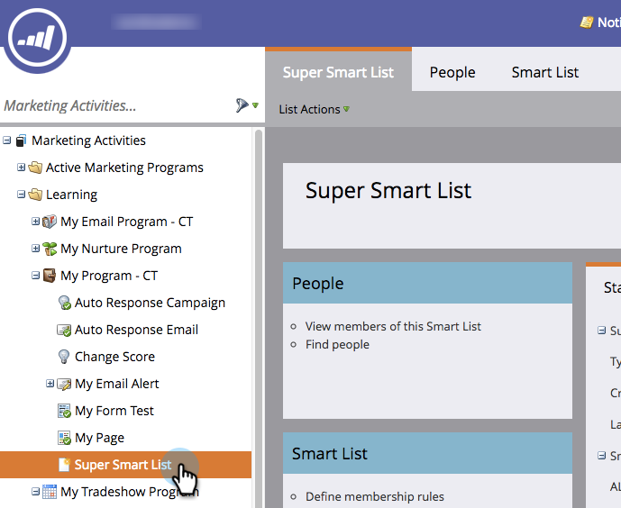

# Clone a List or Smart List {#clone-a-list-or-smart-list}

Instead of creating a smart list from scratch, save some time by cloning a similar one and making changes. Here's how.

1. Go to **[!UICONTROL Marketing Activities]**.

   

1. Select the smart list you want to clone.

   

1. Under **[!UICONTROL List Actions]**, click **[!UICONTROL Clone Smart List]**.

   

1. Enter a **[!UICONTROL Name]** and click **[!UICONTROL Clone]**.

   

Nice job! You can also clone regular lists in the same manner.
