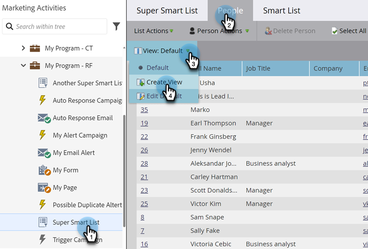
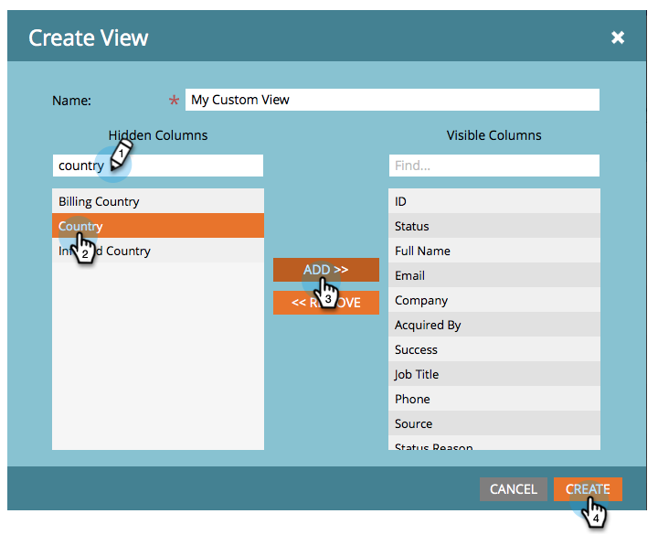
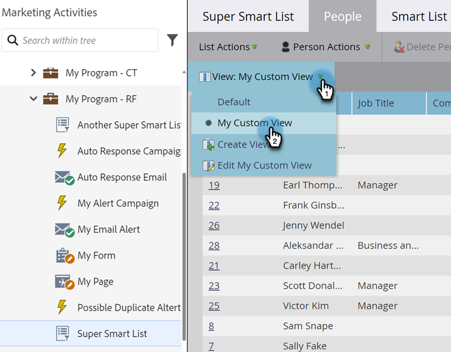
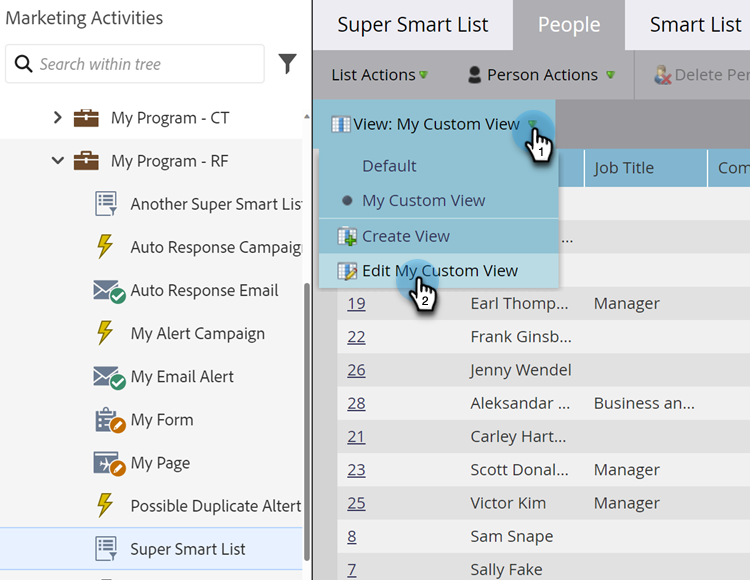
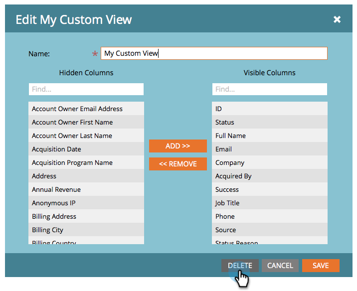

# Create and Change Views for Lists and Smart List {#create-and-change-views-for-lists-and-smart-list}

A Smart List displays a default set of columns. Did you know you could edit those columns to your heart's content? Here's how.

## Create a View {#create-a-view}

1. Go to a list or Smart List, click the **[!UICONTROL People]** tab, and click **[!UICONTROL Create View]** under the **[!UICONTROL View]** drop-down.

   

1. Name the view and find the column you want to add or remove.

   

1. Add/Remove your desired columns, then click **[!UICONTROL Create]**.

   

>[!TIP]
>
>To quickly search, use the **[!UICONTROL Find]** box.

## Switch Views {#switch-views}

1. Click the **[!UICONTROL View]** drop-down, then select the view you want. Switch back and forth between views as needed.

   

>[!NOTE]
>
> You must first create a second view, in addition to the default view, in order to switch views.

## Edit a View {#edit-a-view}

1. Make sure that the view you want to edit is selected in the **[!UICONTROL View]** drop-down.

   

1. Click the **[!UICONTROL Edit]** option.

   

1. Make the changes you want and click **[!UICONTROL Save]**.

   

## Delete a View {#delete-a-view}

1. Select the **[!UICONTROL Edit]** option for the view you want to delete from the **[!UICONTROL View]** drop-down.

   

1. Click **[!UICONTROL Delete]**.

   

Only you can see the custom views you create in the View drop-down, so tell your friends they need to create their own!

>[!MORELIKETHIS]
>
>* [Use Built-in/System Smart Lists](/help/marketo/product-docs/core-marketo-concepts/smart-lists-and-static-lists/using-smart-lists/use-built-in-system-smart-lists.md){target="_blank"}
>* [Create a Smart List](/help/marketo/product-docs/core-marketo-concepts/smart-lists-and-static-lists/creating-a-smart-list/create-a-smart-list.md){target="_blank"}
