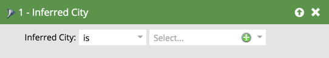
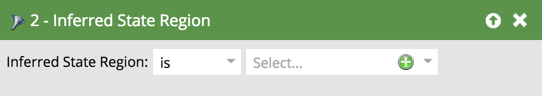
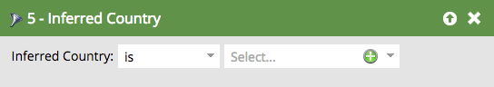

# Inferred Filters {#inferred-filters}

When someone visits your website, [Munchkin](/help/marketo/product-docs/administration/additional-integrations/add-munchkin-tracking-code-to-your-website.md){target="_blank"} cookies them and puts them into the system. We look up their IP in a special database and infer all kinds of info.

>[!NOTE]
>
>To ensure inferred field values stay current, we periodically update the database that's used for IP address lookups. Database updates can introduce new inferred field values that you may need to add to Smart List filter definitions.
>
>Database updates can occur during a [Marketo Engage product release](/help/marketo/release-notes/release-schedule.md){target="_blank"}. When an update does occur, the [Marketo Engage release notes](/help/marketo/release-notes/current.md){target="_blank"} will contain an explanation of any changes to inferred field values.

When you use any of these filters in a Smart List, the results will yield people with this inferred information.

>[!TIP]
>
>Use these filters in a web activity report. Use the territories of the sales reps and subscribe them to a custom daily report with website visitors in the last 24 hours. They will love it!
>
>* Visited Web Page - Last 24 hours
>* Inferred State is [select their territory]

These anonymous visitors are automatically converted into people when they click on an email link or fill out a form. However, they keep all of the inferred information.

>[!NOTE]
>
>Learn more about [anonymous activity and leads](/help/marketo/product-docs/core-marketo-concepts/smart-lists-and-static-lists/managing-people-in-smart-lists/understanding-anonymous-activity-and-people.md){target="_blank"}.
