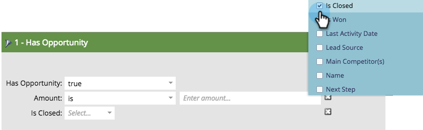
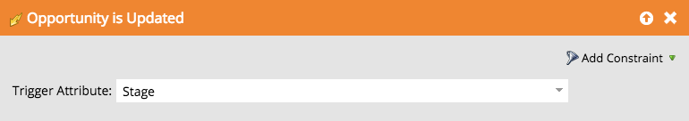

# Opportunity Filters and Triggers {#opportunity-filters-and-triggers}

Opportunity filters and triggers let you track opportunity events from Salesforce. They're a little different compared to other filters and triggers.

## Opportunity Filters {#opportunity-filters}

Opportunity filters let you drill into your Salesforce leads who have opportunities. You can find them in the Opportunities folder of the Palette when editing a smart list. They come in a few flavors.

* Number of Optys
* Total Opty Amount
* Total Opty Expected Revenue
* Has Opportunity
* Opportunity was Added
* Opportunity was Removed
* Opportunity was Updated

If you're looking for your Opportunity fields (custom or standard), use the **Has Opportunity** filter or **Opportunity was `[Added/Removed/Updated]`** filters or triggers.

**Number of Optys, Total Opty Amount, Total Opty Expected Revenue**

With these filters, you can find leads based on the total number, amount, or expected revenue of all their opportunities.

**Has Opportunity, Was Added to Opportunity, Was Removed from Opportunity**

If you're looking for leads who have opportunities based on a combination of criteria, use the **Has Opportunity**, **Was Added to Opportunity**, or **Was Removed from Opportunity** filter. They tell you:

* **Has Opportunity**: If this lead currently has any matching opportunity
* **Was Added to Opportunity**: If this lead was ever added to a matching opportunity
* **Was Removed from Opportunity**: If this lead was ever removed from a matching opportunity

Add the search criteria as **Constraints** on the filter. The constraints include your opportunity standard and custom fields:

For example, say you want to find leads who have open opportunities of at least $5,000. Drag in the **Has Opportunity** filter and use the **Is Closed** and **Amount** constraints:

>[!NOTE]
>
>When you use multiple Opportunity filters, you may get incorrect answers. If you built the example above with two Opportunity filters, you would get a list of leads who have any opportunity that is at least $5,000 and any opportunity that is closed, even if those are separate opportunities.

**Opportunity was Updated**

The **Opportunity was Updated** filter looks for any opportunity when a specific opportunity field was updated. Pick the field to check with the Trigger Attribute pulldown, then use the constraints to narrow down the set of changes.

For example, this filter will show you all leads who had their close date change within the last 30 days:

## Opportunity Triggers {#opportunity-triggers}

The following opportunity triggers are available. They work just like their corresponding filters (described earlier), except that they can trigger campaigns right when the event happens:

* Opportunity is Updated
* Added to Opportunity
* Removed from Opportunity

For example, you could use this Smart List to trigger when any lead is added to any opportunity. In the flow, you might add them to the Marketing Suspended list or send them a targeted email.

To trigger off your opportunity custom fields, use the **Opportunity is Updated** trigger and pick the field in the pulldown:

