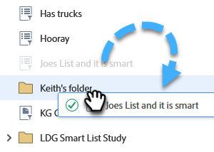

# Reference a List or Smart List Across Workspaces {#reference-a-list-or-smart-list-across-workspaces}

Lists and Smart Lists can be shared and referenced across workspaces for easy reuse from the Database.

>[!NOTE]
>
>Person partition rules apply (Smart Lists and static lists in a workspace only show people who are both members of the list _and_ members of the current workspace).

## Share a List or Smart List {#share-a-list-or-smart-list}

1. Go to the **[!UICONTROL Database]**.

   

1. Right-click a campaign folder. Select **New Folder**.

   

   >[!NOTE]
   >
   >Assets can only be shared across workspaces if they are nested in a folder.

1. Name your folder and click **[!UICONTROL Create]**.

   

1. Drag and drop a list or Smart List you want to share into the new folder.

   

1. Right-click your new folder and select **[!UICONTROL Share folder]**.

   

1. Choose a **[!UICONTROL Workspace]** to share with and click **[!UICONTROL Save]**.

   

   Awesome! This list will now be available in both workspaces.

   >[!NOTE]
   >
   >In Marketing Activities, you can only share top-level folders. In Database, you can share top-level folders as well as one level down.
