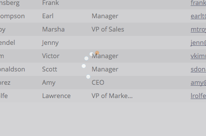

# Refresh a List or Smart List {#refresh-a-list-or-smart-list}

If you've run a Smart List and a few minutes have passed, the results could be different now - refresh to find out.

## Refresh Results {#refresh-results}

1. To update data in the **[!UICONTROL People]** tab of a Smart List, click the refresh icon.

   

1. The Smart List reruns and show you a more up-to-date result set.

   

>[!TIP]
>
>Sometimes when you run a Smart List and come back to it later, you might see the word "About" in front of the person count in the bottom right-hand corner. This indicates that the number is approximate - click the count itself to refresh it and obtain an updated, accurate count.

>[!MORELIKETHIS]
>
>[Export People to Excel from a List or Smart List](/help/marketo/product-docs/core-marketo-concepts/smart-lists-and-static-lists/managing-people-in-smart-lists/export-people-to-excel-from-a-list-or-smart-list.md){target="_blank"}
