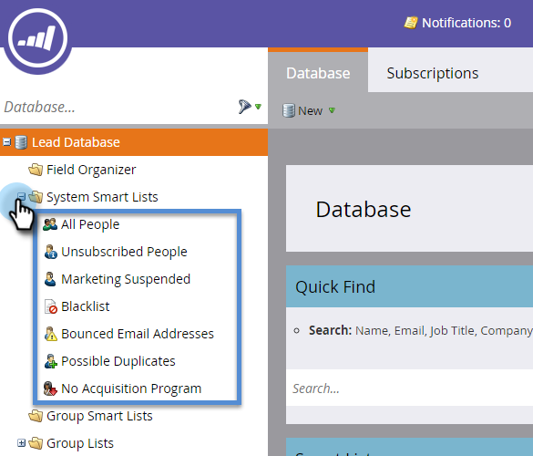

# Use Built-in/System Smart Lists {#use-built-in-system-smart-lists}

Marketo has some very useful built-in smart lists. Let's check them out!

>[!NOTE]
>
>Marketo is in the process of changing terms such as Blacklist and Whitelist to Blocklist and Allowlist in our product. During this update, you may see the old terms in our UI and documentation screenshots, and the new terms in our documentation text. We apologize for any confusion.

1. Go to the **Database**.

   

1. Open the **System Smart Lists** folder to reveal the collection.

   

1. To see one example: Select **All People**, then click the **People** tab.

   

   >[!NOTE]
   >
   >The filters in system smart lists do not need to be applied to each smart list/campaign. Their contents are automatically recognized.

Here's a summary of what the built-in smart lists do:

   | List Name |Description |
   |---|---|
   | All People |All people in your Marketo database |
   | Unsubscribed People |These people can only be sent operational emails; this is usually controlled by the person themselves. |
   | Marketing Suspended |These people can only be sent operational emails; this is usually controlled by you, the marketer. |
   | Blocklist |These people will not receive any email at all. |
   | Bounced Email Addresses |People with an undeliverable email address or that reject your email. |
   | Possible Duplicates |People that might be duplicated in the Marketo database. |

>[!NOTE]
>
>System smart lists can't be deleted. With the exception of the Possible Duplicates list, they cannot be edited, either.

>[!MORELIKETHIS]
>
>[Create a Smart List](/help/marketo/product-docs/core-marketo-concepts/smart-lists-and-static-lists/creating-a-smart-list/create-a-smart-list.md)
