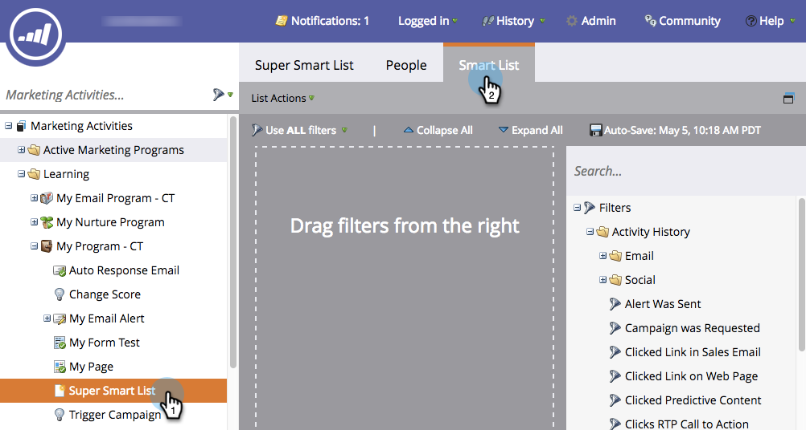
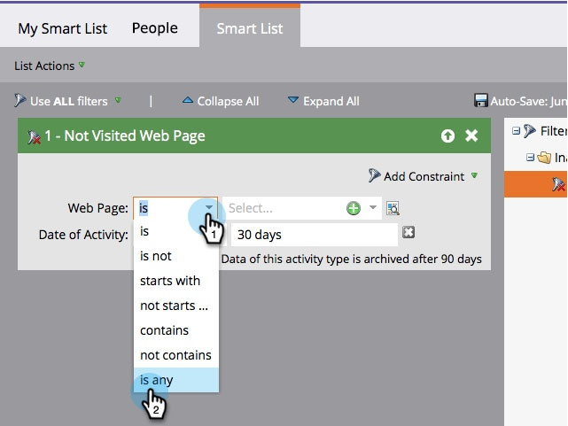

# Use Inactivity Filters in a Smart List {#use-inactivity-filters-in-a-smart-list}

Did you know you can look for people in a Smart List who *didn't* do something? Check out these inactivity filters.

1. Go to **Marketing Activities**.

   

1. Select the smart list you want to edit, then click the **Smart List** tab.

   

1. Find and drag the inactivity filter of your choice into the canvas. As an example, let's find people who have not visited any of your pages.

   

   >[!TIP]
   >
   >There are many filters in the **Inactivity Filters** folder. Search for **Not** and check them out.

1. Select the **is any** operator. This will find all the people who have not visited any page in the last 30 days.

   
