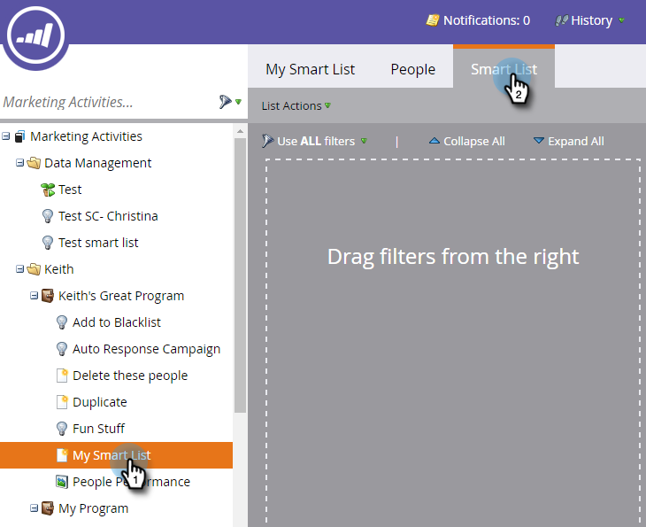
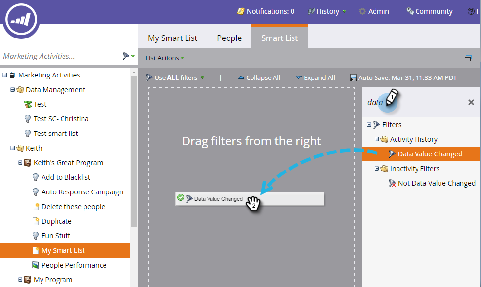
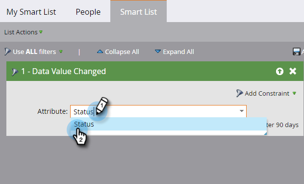

# Use the Data Value Changed Filter in a Smart List {#use-the-data-value-changed-filter-in-a-smart-list}

Values are constantly changing and being updated in your Marketo database. Sometimes instead of looking for a specific value, you want to look for people that have had a change in value. Here's how.

>[!PREREQUISITES]
>
>[Create a Smart List](/help/marketo/product-docs/core-marketo-concepts/smart-lists-and-static-lists/creating-a-smart-list/create-a-smart-list.md)

1. Go to the **Marketing Activities** area.

   

1. Select the smart list and click the **Smart List** tab.

   

1. Find the **Data Value Changed** filter and drag it onto the canvas.

   

1. Set **Attribute** to the field you want to look for data value changes on.

   

This filter will look for all people that had a change (any change) to their Status. If you want to get even fancier, try [adding a constraint to a smart list filter](/help/marketo/product-docs/core-marketo-concepts/smart-lists-and-static-lists/using-smart-lists/add-a-constraint-to-a-smart-list-filter.md).
